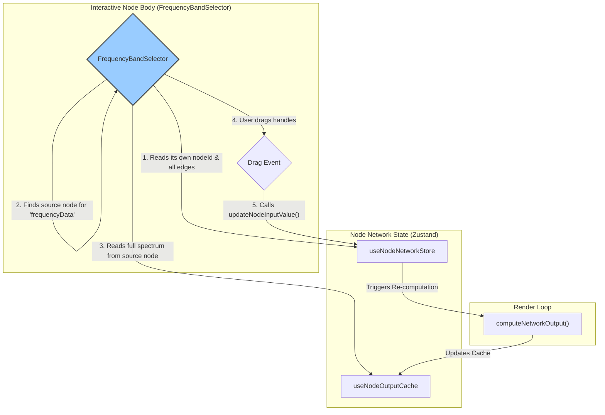

# Interactive Node Architecture

This document outlines the architecture for creating interactive custom node bodies, using the `FrequencyBandNode` as the primary example.

## The Goal

The objective is to move beyond simple numeric inputs and create rich, interactive components inside of our nodes. For the `FrequencyBandNode`, this means replacing the `targetFrequency` and `bandwidth` inputs with a graphical interface where the user can directly see and manipulate a frequency range over a visualization of the full audio spectrum.

## The Architecture

We will enhance the `customBody` component concept to create a full, interactive loop. The component will not only read data for visualization but will also write data back to the node network store to update the node's input values.

Here's the data flow:

1.  **Get Input Data for Visualization**: The `FrequencyBandSelector` component, which acts as the node's body, needs to draw the *full* frequency spectrum as a background. To get this data, it will:
    a. Read the list of all `edges` from the `useNodeNetworkStore`.
    b. Find the specific edge that connects to its own `frequencyData` input handle.
    c. Get the ID of the *source node* from that edge.
    d. Read the output of that source node from the `useNodeOutputCache`. This output is the full frequency spectrum.

2.  **Handle User Interaction**: The component will render draggable handles over the spectrum visualizer. When a user drags these handles:
    a. The component will calculate the new `startFrequency` and `endFrequency` values.
    b. It will call the `updateNodeInputValue` action from the `useNodeNetworkStore`, updating its own state.

3.  **The Loop Completes**: This state update triggers a re-computation of the node network. The `computeNetworkOutput` function runs for the `FrequencyBandNode` with the new frequency range, calculates the new `bandData`, and caches it in the `useNodeOutputCache`. The `FrequencyBandSelector` can then visually update the filtered band if desired.

This creates a highly responsive and performant system where the interactive UI is decoupled from the main render loop but can still drive it.

## Data Flow Diagram

