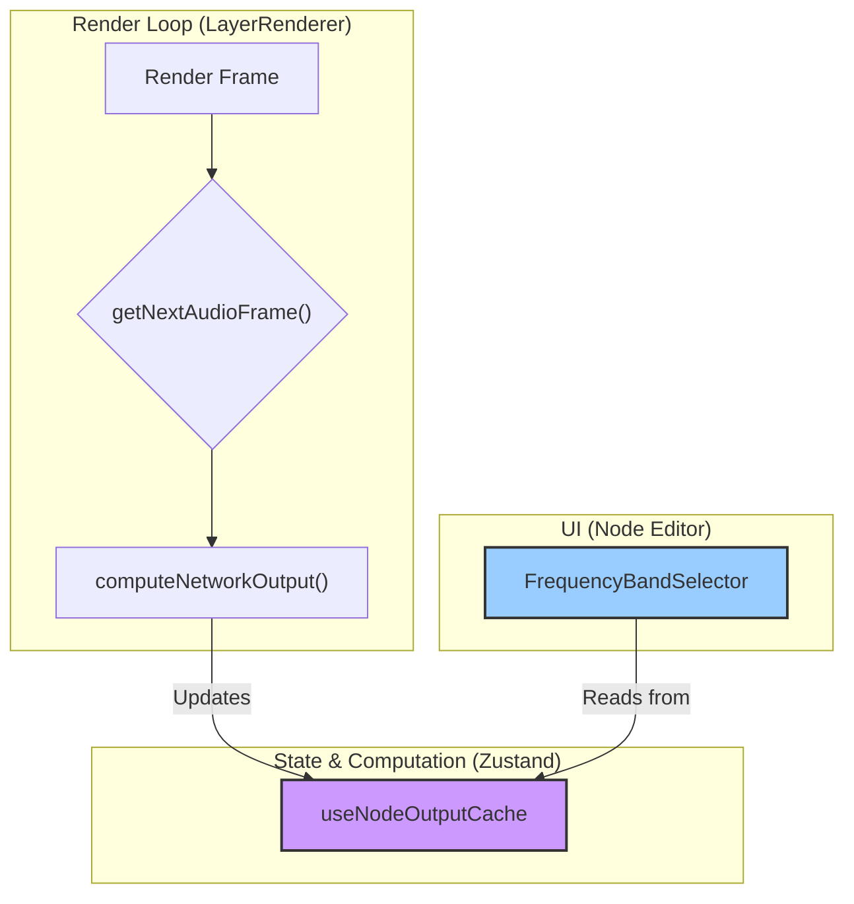

# Node Output Cache Flow Architecture

This document outlines the proposed architecture for caching and visualizing node outputs within the editor.

## The Problem

Currently, there is no way to visualize the output of a node directly within the node graph UI. Displaying this live data is crucial for providing immediate feedback to the user, especially for complex nodes like the `FrequencyBand` filter. However, feeding this data directly into the React component state would cause performance issues, as the data updates on every animation frame, triggering re-renders of the entire node editor.

## The Solution

To solve this, we will introduce a new Zustand store, `useNodeOutputCache`, that is decoupled from the main component state. This creates a performant data flow:

1.  **Render Loop**: The main `LayerRenderer`'s render loop will continue to call `computeNetworkOutput` on every frame.
2.  **State & Computation**: After computing a node's output, the `computeNetworkOutput` function will update the `useNodeOutputCache` with the latest value. This store will *not* be connected to any React components in a way that triggers re-renders.
3.  **UI (Node Editor)**: A specific UI component, like the `FrequencyBandSelector`, will subscribe to the `useNodeOutputCache` *without* using a state-based hook. Instead, it can get the latest value on-demand for rendering on a canvas or other non-reactive element, thus avoiding performance-heavy re-renders of the component tree.

## Data Flow Diagram

The following diagram illustrates this data flow.

