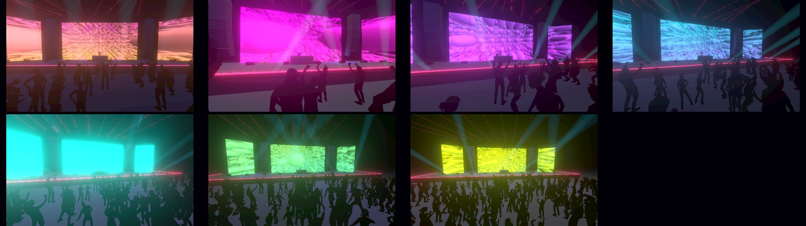
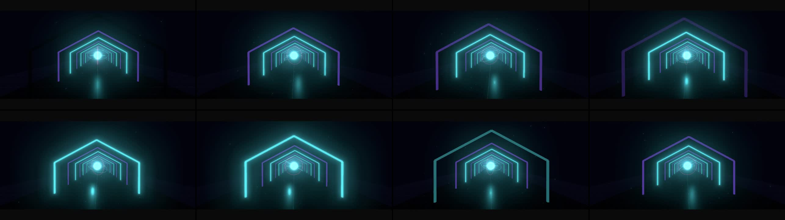

# Gate 1: Human Signal treatment decision request

Status: **pending explicit product-owner decision**

Machine packet: [Gate 1 review packet](./artifacts/2026-09-06-goal-five-gate-one-review-packet.json)

Packet content identity: `sha256:249618da53da44a6c790cd1bb572748d360c408b33b463e40761ed7673b2c400`

## Exact decision requested

Do you approve the exact Human Signal treatment and authorize its Phase 2 successor, or do you request one bounded Phase 1 treatment revision with the required changes stated exactly?

Recommendation: Approve the exact Human Signal treatment and authorize Phase 2 from the content-addressed P1-01 through P1-06 evidence.

Why this remains human-owned: Automated evidence can prove identities, ranges, capability references, derivation, and queue scope, but cannot judge musical truth, emotional coherence, visual taste, performer value, or whether the proposed reusable gaps are worth building.

## What is proposed

**Human Signal** uses the exact 48-second `hiphop-808-rap-f135-d2880` window at 60 fps, five acts, nine responsibility-scoped layers, seven graphs, all four existing Stage performers, three reusable engine gaps, and one Stage-owned camera narrative. Full settings, ranges, graph consumers, risks, review targets, and performance targets remain in the content-addressed P1-05 treatment.

## Bound evidence

Source baseline: `6255e7b23369118427753c4c7d5d3f21d1027b70`.

- **P1-01 authorized-input inventory:** artifact `sha256:d16b54aafac465326d867e2931647f49c90c07b9785c8d692642d69dd22c705d`; review `sha256:b33ce4ae3489d688c7359179ed3b58ad615c8a21e0fa868e82a2a39e8d7a47e7`.
- **P1-02 capability and observation audit:** artifact `sha256:b1fcf990b8d45f4524f4051e16a5823dd46744f87db7b9c8b0f35b31606bff1e`; review `sha256:d0dad181201ddf6f35017b664b19f1d0538f27c31198ef1c30fdef50e47a34b3`.
- **P1-03 exact source-audio analysis and candidate windows:** artifact `sha256:e94ef2932f0ddd28f730711111e14d6d35ff952bc3328905f1e89dd6bb6657cc`; review `sha256:13a33d40431d8e1982dc0cb5645ccc660d69e4e4479a69cb1013cfbcb99b1e5e`.
- **P1-04 frame-exact proposed musical map:** artifact `sha256:164395d23891a091d9374c48d3462c9b30ee8ac4aac4ac4c6dfe68f700568a55`; review `sha256:c0a624ff615b1262b641b3d99b19d318d622ca736feaad647a2d445b6799b812`.
- **P1-05 proposed flagship production treatment:** artifact `sha256:cf65ee4f7dab2cc36d5a502fbc3ae37cd60e08a2d72a2e73df175100e86723a2`; review `sha256:f5ebffe3fb683f62f497a31e3860b0efd93164fb924cae15752444adcb827c9a`.

## Existing-capability visual references

No Human Signal frame, project, or prototype exists yet. The references are prior-production capability evidence only; planned P1-05 still frames and motion windows are review targets, not observed renders.

### afterlight-human-stage-baseline

- Identity: `sha256:fad1dc12d81894b6b39d34c75d5b9e95f00c12a8361289255fcc80cae7a1fcce`; 2584×728.
- Demonstrates: Existing model-backed Stage Scene quality, human anchors, venue lighting, and cinematic camera range.
- Does not demonstrate: Human Signal composition, selected music, timing, graph behavior, layer interaction, performance, or final quality.

### signal-cathedral-procedural-language

- Identity: `sha256:852419d591a4139b31f5e43071f3512d3b1dee028932b23701d389cb4c5ff372`; 2572×724.
- Demonstrates: Existing procedural spatial, luminous material, negative-space, and palette vocabulary.
- Does not demonstrate: Human Signal composition, selected music, timing, graph behavior, layer interaction, performance, or final quality.

## Assumptions to judge

- The exact 48-second HipHop 808 Rap window is the right creative source, not merely the strongest automated candidate.
- The five-act map expresses the perceived musical and emotional structure well enough to direct production.
- A human-led stage plus independent compositor-space procedural worlds is coherent rather than a capability sampler.
- The ultraviolet, cyan, amber, and near-black palette; luminous material language; and one Stage-owned camera arc are the right taste direction.
- All four existing performer models add value and can be grounded, framed, and lit to the required quality.
- Excluding standalone raster/image/video for this treatment is creatively acceptable.
- GAP-01 through GAP-03 are the smallest worthwhile reusable changes before materializing the production.

## Unresolved creative judgments

- Is this the intended track and exact window?
- Does the five-act emotional arc feel musically true?
- Is Human Signal distinct and aesthetically coherent rather than a capability sampler?
- Are palette, material language, fixed Panoramic Sweep, and layer hierarchy right?
- Are all four performers worth retaining and visually grounded?
- Is the raster/image/video exclusion acceptable?
- Are GAP-01 through GAP-03 worth implementing as defined?

## Alternatives

- Request one bounded Phase 1 treatment revision and state the exact musical, visual, scope, or gap changes required.
- Do not select the Stage-only, procedural-monolith, or falsely shared-Three-world directions; they fail the accepted breadth or architecture constraints.

The P1-05 treatment also records the rejected Stage-only, procedural-monolith, and false shared-world directions with their exact reasons.

## Waiting boundary

Safe while pending:

- Read-only inspection, product-owner discussion, and correction of demonstrably incorrect evidence only.

Prohibited while pending:

- Do not activate Phase 2 or begin deep aesthetic implementation.
- Do not add production-local components or build GAP-01 through GAP-03.
- Do not resolve this human decision autonomously or treat silence, discussion, or elapsed time as approval.

`G1-01` is the sole blocked work item. No other program work is declared safe. Discussion, silence, or elapsed time is not approval, and this document does not record a decision.
