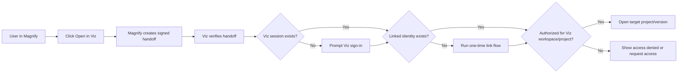

# Linked-Account And SSO Flow Design

## Purpose

This document defines the concrete identity and handoff experience between
Magnify and Viz Cloud.

It exists to answer:

- what a Magnify user experiences when opening Viz
- what identity records exist in Viz
- how linked accounts differ from SSO
- how human session flow differs from service integration flow
- what the first implementation should be

## Core Goal

We want the user experience to feel connected and native without collapsing the
two products into one auth system too early.

The target feeling is:

1. the user is already inside Magnify
2. they click `Open in Viz`
3. Viz opens the right workspace and project context
4. the user does not have to hunt for the scene or re-describe intent

At the same time, we want to preserve:

- Viz as its own product
- Magnify as its own product
- no shared DB-level identity coupling
- clear ownership of authorization

## Core Decision

The preferred first implementation is:

- separate auth systems
- linked user identities
- signed short-lived deep-link handoff from Magnify to Viz

Shared SSO is a future option, not the baseline.

## Why This Is The Right First Move

This gives us:

- strong UX after first link
- clean product boundaries
- no premature identity unification
- a realistic first implementation path

It avoids:

- shared user tables
- shared session storage
- auth stack entanglement
- forcing Viz to stop being a standalone product

## Non-Goals

This document is not trying to make:

- Magnify the owner of Viz authorization
- Viz dependent on Magnify to function
- browser-session SSO mandatory on day one
- local OSS Viz usage dependent on cloud identity

## Identity Layers

We must distinguish these clearly:

1. authentication identity
2. linked external identity
3. workspace authorization
4. integration service identity

These are separate concerns.

## 1. Authentication Identity

This answers:

- who is this user inside Viz?
- who is this user inside Magnify?

Each product owns its own auth/account model.

## 2. Linked External Identity

This answers:

- which Magnify identity corresponds to which Viz identity?

This is the cross-product relationship layer.

## 3. Workspace Authorization

This answers:

- can this Viz identity access this Viz workspace/project/version?

Linked identity is not authorization.

## 4. Integration Service Identity

This answers:

- which Magnify backend client is allowed to call Viz APIs?

This is separate from human sessions and should never be faked through a human
browser login.

## Decisions Locked Now

### Decision 1: Viz and Magnify keep separate auth systems

We are deciding now that Viz and Magnify should each own their own auth/account
system.

That means:

- no shared user table
- no shared session store
- no DB-level identity coupling

### Decision 2: Linked accounts are the preferred Phase 1 human flow

We are deciding now that the first connected-workspace implementation should be
linked accounts, not full shared SSO.

That means:

- a Magnify user can connect to a Viz account
- a user may authenticate in each product once
- future opens become nearly seamless

### Decision 3: Shared SSO is a future option

We are deciding now that full shared SSO may become desirable later, but it
should not be the dependency that blocks first-class Magnify integration.

### Decision 4: Human flow and service flow are separate

We are deciding now that:

- human browser navigation
- service-to-service API trust

must be designed separately.

### Decision 5: Viz owns Viz authorization

We are deciding now that Magnify may request a Viz open or render, but Viz
still owns the final authorization decision for Viz workspaces, projects, and
versions.

## The Three Main Models

## Model A: Fully Separate Accounts

Flow:

- user is logged into Magnify
- user clicks `Open in Viz`
- if not logged into Viz, they log in manually
- Viz checks access and opens or denies

### Pros

- simplest technically
- strongest product separation

### Cons

- too much friction
- too weak a connected-workspace experience

This is acceptable as a fallback state, but not the preferred product flow.

## Model B: Linked Accounts

Flow:

- user is logged into Magnify
- user clicks `Open in Viz`
- Magnify sends a signed handoff request
- Viz checks whether that Magnify identity is linked to a Viz identity
- if linked and authorized, Viz opens directly
- if not linked, Viz runs a one-time link flow
- future opens are nearly seamless

### Pros

- strong UX after first link
- preserves separate product ownership
- avoids DB coupling
- realistic to implement early

### Cons

- more moving parts than fully separate accounts
- still not pure one-login SSO

This is the preferred Phase 1 model.

## Model C: Full Shared SSO

Flow:

- user authenticates through a shared identity provider
- Magnify and Viz both trust that provider
- user clicks `Open in Viz`
- Viz recognizes the same identity and opens directly if authorized

### Pros

- cleanest UX
- closest to one-login behavior

### Cons

- more auth and product coupling
- more infrastructure complexity
- too much dependency too early

This is a future option, not a baseline requirement.

## Phase 1 Product Principle

The user should feel like Magnify and Viz are connected, while the systems stay
separate under the hood.

That means:

- separate auth ownership
- linked identities
- signed handoff
- explicit workspace authorization

## Canonical Records

Viz Cloud should model a small explicit set of identity-related records.

## Viz Account

```ts
type VizAccount = {
  id: string;
  email?: string;
  displayName?: string;
  kind: "human" | "service";
  createdAt: string;
  updatedAt: string;
  metadata?: Record<string, unknown>;
};
```

This is Viz's own account identity.

## Linked External Identity

```ts
type VizLinkedExternalIdentity = {
  id: string;
  accountId: string;
  provider: "magnify" | string;
  externalUserId: string;
  externalWorkspaceId?: string;
  createdAt: string;
  updatedAt: string;
  metadata?: Record<string, unknown>;
};
```

This record means:

- this Viz account is linked to this external Magnify identity

It does not mean:

- this user can access every Viz workspace

## Workspace Membership

```ts
type VizWorkspaceMembership = {
  id: string;
  workspaceId: string;
  accountId: string;
  role: "owner" | "admin" | "editor" | "viewer";
  createdAt: string;
  updatedAt: string;
};
```

This is where actual workspace access is modeled.

## Integration Client

```ts
type VizIntegrationClient = {
  id: string;
  provider: "magnify" | string;
  workspaceScope?: string[];
  permissions: string[];
  createdAt: string;
  updatedAt: string;
  metadata?: Record<string, unknown>;
};
```

This is the machine-facing identity for service calls.

## Handoff Grant

Viz should treat Magnify-to-Viz browser handoff as a grant-like event, even if
the first implementation uses a compact signed payload rather than a complex
OAuth flow.

Preferred conceptual shape:

```ts
type MagnifyToVizOpenRequest = {
  magnifyUserId: string;
  magnifyWorkspaceId?: string;
  vizWorkspaceId: string;
  vizProjectId: string;
  vizProjectVersionId?: string;
  requestedView?: "working-head" | "version";
  returnUrl?: string;
  issuedAt: string;
  expiresAt: string;
  nonce: string;
  signature: string;
};
```

## Human User Flow

This is the recommended Phase 1 browser flow.



## Default Happy Path

1. user is signed into Magnify
2. user clicks `Open in Viz`
3. Magnify creates a signed short-lived handoff request
4. Viz verifies the handoff
5. Viz resolves the linked Viz account
6. Viz checks workspace/project access
7. Viz opens the requested project context

This is the default experience we want once accounts are linked.

## First-Time Link Flow

This is the expected first-use flow.

1. user is in Magnify
2. user clicks `Open in Viz`
3. Magnify sends the signed handoff request
4. Viz verifies the request
5. Viz sees no existing linked external identity
6. Viz prompts the user to sign in or create a Viz account
7. Viz creates the linked external identity record
8. Viz checks workspace authorization
9. Viz opens the requested target or shows access resolution UI

Important rule:

- account linking should be explicit once
- it should not require repeated confirmation on every open

## Linked But Unauthorized Flow

This is different from “not linked.”

If the user is linked but does not have access to the requested Viz workspace
or project:

- Viz should say that clearly
- Viz should offer request-access or invite flow if supported
- Viz should not silently create access

This keeps identity linking and authorization cleanly separated.

## Missing Target Flow

If Magnify references a Viz target that does not exist anymore:

- Viz should show a clear stale-reference state
- the response back to Magnify should indicate `not_found` or
  `stale_reference`
- the user should not land on an unrelated project silently

## Version Vs Working Head Open Rules

We should make this explicit because it will matter a lot in real use.

### Default rule

Magnify should normally open:

- a specific Viz project
- optionally a specific stable version context

### Working head rule

If Magnify wants Viz to open the mutable working head, that must be explicit.

This avoids confusion between:

- editing draft state
- inspecting published or approved state

### Recommended UI wording

Good wording would be close to:

- `Open draft in Viz`
- `Open published version in Viz`

not vague language like:

- `Open visual`

## What Magnify Should Store

Magnify should store only stable Viz references and integration metadata, not
Viz auth internals.

Preferred Magnify-side fields are conceptually:

```ts
type MagnifyVizReference = {
  vizWorkspaceId: string;
  vizProjectId: string;
  vizProjectVersionId?: string;
  openMode?: "working-head" | "version";
};
```

Magnify should not store:

- Viz session secrets
- Viz internal account records
- Viz membership tables

## Service-To-Service Flow

Human flow and backend integration flow are separate.

Magnify services may need to call Viz APIs for:

- preview requests
- render requests
- bake requests
- project/version reads
- deep-link preparation

This should use:

- service credentials
- scoped permissions
- API-level trust

It should not use:

- human browser sessions
- session impersonation
- hidden coupling to Viz DB state

## Recommended Service Flow

1. Magnify backend authenticates as a registered Viz integration client
2. Magnify calls Viz API with explicit workspace/project/version identifiers
3. Viz verifies client scope and permissions
4. Viz creates or returns the requested resource/job
5. Viz returns structured ids and artifact refs

## API Direction

We do not need to lock final endpoint naming yet, but the boundary should look
roughly like this:

- `POST /api/integrations/magnify/open-link`
- `POST /api/integrations/magnify/render-jobs`
- `POST /api/integrations/magnify/bake-jobs`
- `GET /api/integrations/magnify/projects/:id`
- `GET /api/integrations/magnify/project-versions/:id`

The important rule is not the path names.

The important rule is:

- explicit ids
- explicit permissions
- explicit responses

## Failure Cases

We should define these explicitly now.

### Case 1: Invalid or expired handoff request

Behavior:

- reject the request
- show safe retry path
- optionally send the user back to Magnify

### Case 2: No Viz session and no linked account

Behavior:

- prompt Viz sign-in
- then prompt one-time link flow

### Case 3: Linked identity but no workspace access

Behavior:

- show access denied or request-access flow

### Case 4: Target project/version missing

Behavior:

- show not found or stale reference state
- return a clear machine-readable error to Magnify

### Case 5: Integration client exists but lacks required scope

Behavior:

- reject with authorization error
- log the denied call

## Security Rules

We should lock these now:

1. handoff requests must be signed and short-lived
2. handoff requests must include expiry and nonce data
3. Viz must verify the request before any redirect/open behavior
4. linked identity must never bypass workspace authorization
5. service credentials must be scoped
6. Magnify and Viz should integrate at auth/API level, not DB level

## Better Auth Relationship

Better Auth fits the Viz side of this model for:

- Viz sessions
- sign-in flows
- browser auth UX
- account creation

Better Auth does not replace the need for Viz to own:

- linked external identity records
- workspace authorization
- integration client trust
- Magnify handoff semantics

## Future Shared SSO Upgrade Path

If later we decide that product maturity justifies deeper identity unification,
the clean upgrade path is:

1. keep the same workspace authorization model
2. keep the same project/version references
3. swap the human auth experience from linked accounts to shared identity
4. keep service integration flow separate

That means the Phase 1 linked-account model should not paint us into a corner.

## Final Product Posture

The intended posture is:

- Viz remains a standalone product
- Magnify gains a connected-workspace experience
- the user feels a native bridge between them
- full SSO stays optional

This is the cleanest first architecture.

## Decisions Locked In Here

We are deciding all of this now:

1. separate Viz and Magnify auth systems remain the default posture
2. linked accounts are the preferred Phase 1 human flow
3. full shared SSO is a future option, not a prerequisite
4. linked identity and workspace authorization are separate checks
5. Viz owns Viz authorization
6. service-to-service identity is separate from human identity
7. Magnify-to-Viz opens should use signed short-lived handoff requests
8. Magnify should reference explicit Viz ids, not Viz auth internals

## Next Docs To Write

The strongest next follow-up docs are:

1. local persistence and import/export model
2. future MCP/tool surface inventory
3. specialized AI runner vision
