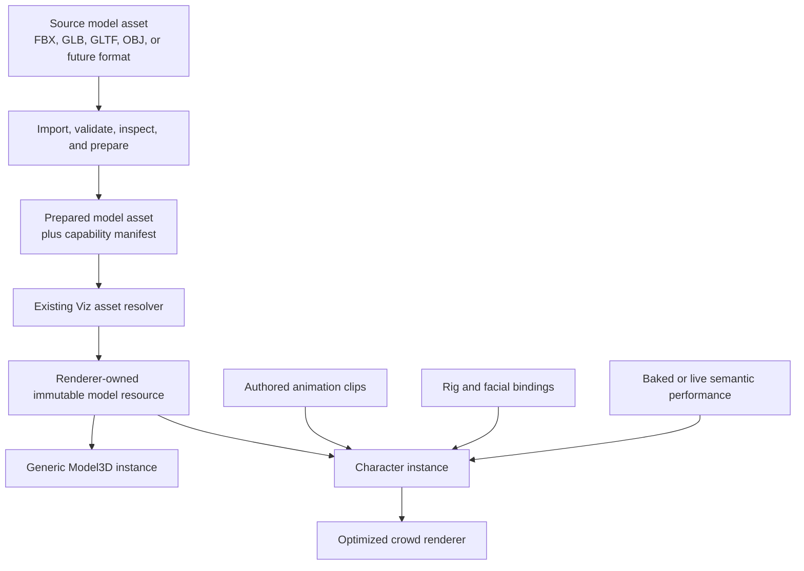

# Native 3D Model, Character, And Performance System Spec

## Status

This document records the accepted V2 direction for external 3D models,
characters, crowds, authored animation, and future facial performance.

The product decision is:

- external 3D files remain a native VizEngine capability
- the production Stage experience retains high-quality model-backed DJ and
  crowd characters
- the retained procedural Stage actors are a deterministic fallback and
  migration placeholder, not the accepted final visual-parity target
- V2 must replace the historical browser-owned FBX implementation without
  replacing model-backed visual quality

This specification defines the target paradigm and system boundaries. It does
not require every future character feature to be implemented during the first
Stage restoration slice.

## Related Contracts

This specification specializes the existing V2 architecture rather than
creating a parallel asset or runtime system:

- [Viz Project Document Spec](./viz-project-document.md)
- [Asset Resolver And Storage Abstraction Spec](./asset-resolver-and-storage-abstraction-spec.md)
- [Asset Lifecycle And Derivation Job Model](./asset-lifecycle-and-derivation-job-model.md)
- [V2 Bake Artifact Contract](./bake-artifact-contract.md)
- [V2 Component Contract](./component-contract.md)
- [Multi-Renderer And Backend Capability Vision](../../visions/multi-renderer-and-backend-capability-vision.md)
- [V2 Product, Architecture, And Parity Alignment](../../visions/v2-product-architecture-and-parity-alignment.md)
- [Runtime-Backed Rendering Cutover](../../plans/v2/runtime-backed-rendering-cutover.md)

The general asset resolver remains authoritative for storage and
materialization. The bake contract remains authoritative for reusable
computational artifacts. This document owns the 3D-specific specialization of
those boundaries.

## Purpose

VizEngine needs a clean native system for:

- static and animated external 3D models
- rigged characters and creatures
- embedded and external animation clips
- deterministic preview, seeking, and final rendering
- large animated crowds
- future motion capture and animation retargeting
- future facial expression, speech, and singing performance
- local, bundle, cloud, and Magnify-provided asset resolution
- human and AI inspection and authoring

The system must preserve the visual value of authored 3D content without
reintroducing editor-owned URLs, hidden browser state, mutable wall-clock
animation, or Stage-specific asset loaders.

## Core Position

VizEngine should not build a character-only asset pipeline.

VizEngine should also not build one giant universal 3D abstraction containing
every possible model, character, face, crowd, speech, and renderer concern.

The preferred architecture is:

1. a generic native 3D model asset substrate
2. a renderer-owned model resource and instancing layer
3. deterministic generic animation sampling
4. optional character semantics over model capabilities
5. specialized facial-performance and crowd systems over the character layer

The stable boundaries should be generic.

Behavior-specific systems should remain focused.

## Core Rule

A model is durable content.

A model instance is scene configuration.

A character binding gives model data human or creature semantics.

A performance is time-varying input.

These are different concepts and must not be collapsed into one object,
component setting blob, renderer cache, or file format.

## System Overview



## Goals

The system must:

- make models first-class canonical project assets
- support models with or without animation
- retain the original imported source and explicit provenance
- support format-specific import through replaceable adapters
- prepare renderer-friendly derivatives when useful
- expose inspectable model capabilities and stable identifiers
- give preview and final render the same resolved model content
- define every rendered pose from canonical frame inputs
- support direct random access to any frame
- make loading, readiness, failure, and disposal explicit
- scale from one hero character to large crowds
- leave clean extension points for rig mapping, retargeting, facial performance,
  speech, singing, and AI-authored motion
- expose stable actions and metadata for both editor and agent operation

## Non-Goals

The first implementation does not need to:

- support every 3D format
- invent a renderer-neutral replacement for GLTF or GLB
- provide universal animation retargeting
- infer semantic humanoid rigs for every imported model
- provide production speech recognition or lip sync
- support every renderer backend
- guarantee identical pixels across different GPU drivers
- run one independent CPU animation mixer per member of a 1,000-person crowd
- preserve the historical Stage loader or crowd shader as compatibility code

The architecture must leave room for later capabilities without implementing
them speculatively.

## Terminology

### Source Model Asset

The original imported file or file set.

Examples:

- an FBX file
- a GLB file
- a GLTF document plus its buffers and textures
- an OBJ plus material and texture dependencies

The original source should remain available when storage policy permits so it
can be reprocessed with newer importer versions.

### Prepared Model Asset

A durable managed asset derived from a source model for reliable runtime use.

It may contain:

- normalized or packaged model bytes
- embedded or rewritten texture dependencies
- mesh or texture compression
- generated normals or tangents
- validated animation data
- optional LOD variants
- optional thumbnails
- a capability manifest
- derivation provenance

A prepared model is a derived managed asset, not a hidden cache and not a bake
artifact.

### Model Capability Manifest

Small typed metadata describing what a model contains and how downstream
systems may address it.

The manifest describes content. It does not duplicate the model's complete
geometry, textures, or animation curves into project JSON.

### Model Resource

The renderer-owned, parsed, mostly immutable in-memory representation of a
resolved model asset.

It may own renderer-native geometry, materials, textures, skeleton templates,
and animation data.

It is not scene truth and must never be serialized into
`VizProjectDocument`.

### Model Instance

One placement of a model resource in a scene.

An instance may define:

- transform
- visibility
- material overrides
- shadow behavior
- selected clip
- deterministic playback settings
- morph-target values

### Character Binding

Optional semantic metadata that maps a model's implementation-specific nodes,
bones, and morph targets to meaningful character roles.

Examples:

- hips
- head
- left hand
- jaw
- left eye
- mouth-open morph
- smile morph
- viseme channel

A model can render and play its embedded clips without a character binding.

### Performance

Time-varying instructions applied to a model or character.

Examples:

- an authored skeletal animation clip
- an authored morph-target clip
- mocap data
- a retargeted dance
- facial-expression curves
- viseme curves derived from speech or singing
- look-at and gesture instructions

### Baked Performance Artifact

A typed, versioned timeline of reusable performance data derived from another
input such as audio, video, mocap, or an AI operation.

It is support data for runtime evaluation, so it belongs to the bake artifact
family rather than the managed display-asset family.

## Architectural Separation

The following layers must remain distinct.

### 1. Canonical Asset Identity

`VizProjectDocument` stores stable references to model assets.

It does not store:

- application bundle URLs
- absolute filesystem paths
- Three.js objects
- loader instances
- unresolved external texture paths
- browser cache keys

### 2. Asset Resolution

The existing asset resolver turns canonical model refs into runtime-usable
bytes, files, or URLs for the current environment.

Resolution may differ across:

- local project storage
- portable bundles
- Viz Cloud
- Magnify-provided resolved inputs

Those differences must not change model or animation semantics.

### 3. Import And Preparation

Format-specific tooling validates and prepares source models.

This work belongs outside frame evaluation and should usually happen when an
asset is imported, replaced, republished, or explicitly reprocessed.

### 4. Renderer Resource Ownership

The selected renderer parses prepared model bytes and owns GPU resources,
instantiation, invalidation, and disposal.

Three.js is the first serious model backend.

Core project and runtime contracts must not contain Three.js scene objects.

### 5. Deterministic Runtime Evaluation

The runtime resolves canonical frame time, animation settings, graph inputs,
artifact inputs, and seeded variation into an explicit instance state.

The renderer presents that state.

### 6. Specialized Semantics

Character rigging, face binding, retargeting, speech performance, and crowd
optimization build on the model substrate.

They do not redefine asset loading or project identity.

## Asset Taxonomy

The system must distinguish:

1. source model assets
2. prepared model assets
3. external authored motion assets
4. baked performance or optimization artifacts
5. model instances in scene truth
6. preview and final render outputs

### Source And Prepared Models

Both source and prepared models are durable managed assets.

Preparation provenance should record:

- source asset content identity
- importer identifier and version
- preparation operation and version
- preparation parameters
- dependency identities
- output content identity
- warnings and validation results where appropriate

### Authored Motion Assets

Animation supplied as reusable authored content may eventually become a
first-class motion asset.

Examples:

- standalone FBX animation
- BVH mocap
- reusable GLTF animation library

The first Stage restoration may use embedded clips and does not need to lock a
standalone motion-asset contract prematurely.

### Baked Performance Artifacts

Generated timelines belong to baked artifacts when they are runtime support
data rather than directly displayable media.

Examples:

- speech-to-viseme curves
- singing mouth-shape curves
- facial-expression inference
- retargeted or reduced runtime animation data
- simulation-driven secondary motion
- crowd animation textures or clip-sampling tables

### Scene Instances

Transforms, selected clips, material overrides, playback rules, and bindings
belong to scene/component configuration.

Creating a second model instance must not create a second managed asset.

## Model Asset Kind

The long-term canonical asset taxonomy should include a first-class `model`
kind.

The executable V2 contract currently exposes:

```ts
type VizAssetKind = "audio" | "image" | "video" | "binary";
```

Model-backed proofs may continue using `binary` during the bounded contract
migration.

That is transitional transport compatibility, not the final semantic model.

The preferred direction is:

```ts
type VizAssetKind =
  | "audio"
  | "image"
  | "video"
  | "model"
  | "binary";
```

`binary` should remain available for genuinely opaque payloads.

Important model semantics must not live indefinitely as unvalidated arbitrary
`metadata`.

## Source Format And Runtime Format

Import support and runtime representation are different concerns.

### Import Posture

The system should support common external model formats through adapters.

Initial priority:

1. GLB and GLTF
2. FBX
3. other formats only when a real product need justifies them

FBX remains a supported source format because existing high-value models and
animations use it.

### Runtime Posture

GLB is the preferred prepared browser-runtime representation where conversion
preserves the intended appearance and behavior.

Reasons include:

- packaged scene hierarchy, meshes, materials, skins, morphs, and clips
- fewer loose dependency-path problems
- stronger browser-runtime interoperability
- better opportunities for mesh and texture compression
- a smaller format-specific runtime surface

This is a preference, not a dogma.

If conversion changes the Stage assets materially, the first restoration may
use content-pinned FBX through the same canonical resolver and resource
lifecycle. Visual parity must be measured before removing the original runtime
path.

### Original Preservation

Runtime preparation must not silently destroy or replace the original source.

The source and prepared derivative should remain linked through explicit
provenance.

## Import And Preparation Pipeline

The preferred lifecycle is:

1. register the imported source and its dependencies
2. compute source content identities
3. detect the actual format rather than trusting only the extension
4. validate file structure, dependency paths, and bounded resource limits
5. parse and inspect model capabilities
6. resolve or package dependent textures and buffers
7. preserve coordinate/unit information explicitly
8. prepare a runtime derivative when requested
9. generate the capability manifest
10. store derivation provenance and output identity
11. expose warnings and failures to editor and agent surfaces
12. resolve the prepared result through the normal asset resolver

Preparation must not:

- suppress loader warnings globally
- replace missing textures silently
- depend on an editor development bundler
- fetch undeclared arbitrary URLs during final render
- mutate the source asset in place
- hide importer failures behind an apparently successful placeholder

## Capability Manifest

The exact executable schema should be introduced only with its implementation,
but the intended conceptual shape is:

```ts
interface VizModelManifest {
  schemaVersion: string;
  sourceFormat: string;
  runtimeFormat: string;
  sourceContentIdentity: string;
  preparedContentIdentity: string;
  importer: {
    id: string;
    version: string;
  };
  coordinateSystem: {
    upAxis: "x" | "y" | "z";
    handedness: "left" | "right";
    metersPerUnit?: number;
  };
  bounds: {
    min: [number, number, number];
    max: [number, number, number];
  };
  nodes: VizModelNodeDescriptor[];
  materials: VizModelMaterialDescriptor[];
  skeletons: VizModelSkeletonDescriptor[];
  animationClips: VizModelAnimationClipDescriptor[];
  morphTargets: VizModelMorphTargetDescriptor[];
  capabilities: {
    staticMesh: boolean;
    transformAnimation: boolean;
    skeletalAnimation: boolean;
    morphAnimation: boolean;
    embeddedCameras: boolean;
    embeddedLights: boolean;
  };
  warnings?: VizModelValidationIssue[];
}
```

Descriptors should provide stable names or ids, display labels, and the minimum
metadata required for inspection and binding.

The manifest must remain compact and versioned.

## Generic Model Instance Contract

A general model-backed component should support models with or without
animation.

Conceptual configuration:

```ts
interface VizModel3DSettings {
  modelAssetId: string;
  transform: {
    position: [number, number, number];
    rotation: [number, number, number];
    scale: [number, number, number];
  };
  visibility?: Record<string, boolean>;
  materialOverrides?: VizModelMaterialOverride[];
  shadows?: {
    cast: boolean;
    receive: boolean;
  };
  animation?: VizModelAnimationPlayback;
  morphWeights?: Record<string, number>;
  embeddedContentPolicy?: {
    cameras: "ignore" | "allow-selected";
    lights: "ignore" | "allow-selected";
  };
}
```

The final schema may use existing layer-transform conventions rather than
duplicating them. The important rule is that these values remain canonical,
serializable, inspectable, and action-addressable.

### Generic Model3D Responsibilities

A generic model component may own:

- asset selection
- placement
- node visibility
- material overrides
- shadow behavior
- embedded deterministic clip playback
- morph-target values
- selected embedded camera or light policy where explicitly supported

It must not own:

- speech recognition
- humanoid assumptions
- crowd allocation
- global asset storage
- hidden browser loading state
- arbitrary animation state machines

## Character Layer

A character is a model instance plus optional semantic bindings and
performance inputs.

The character layer should support:

- named skeleton/rig selection
- embedded clip selection
- deterministic clip playback
- optional rig profile
- optional animation retargeting
- optional facial binding
- optional semantic performance artifact
- optional live performance input in live mode

### Character Capability Is Optional

Not every model is humanoid.

Not every rig is compatible with every animation.

Not every face uses morph targets.

The system should discover and declare capabilities rather than filling a
universal character object with dozens of meaningless optional fields.

## Rig Profiles And Retargeting

### Embedded Animation

An embedded clip authored for the model's original skeleton should be the
lowest-complexity production path.

The first Stage parity implementation should use the existing models' embedded
clips unless evidence requires another approach.

This does not require a universal humanoid rig profile.

### Semantic Rig Profile

Cross-model animation reuse requires an explicit mapping from
implementation-specific bones to semantic roles.

Conceptual roles may include:

- root
- hips
- spine
- chest
- neck
- head
- left and right upper/lower arms
- left and right hands
- left and right upper/lower legs
- left and right feet
- jaw and eyes where bone-driven

A rig profile must also record required rest-pose and coordinate assumptions.

### Retargeting

Retargeting should be an explicit operation with:

- source rig profile
- target rig profile
- source clip identity
- algorithm and version
- parameters
- warnings
- deterministic output identity

Retargeted motion may be:

- sampled directly when cheap and stable
- prepared as a durable motion asset
- baked as reusable runtime support data

The choice should depend on whether the result is authored reusable content or
runtime support data.

## Deterministic Animation Contract

Models do not conflict with deterministic rendering.

Animation curves are deterministic when sampled from explicit time and pinned
content.

### Absolute Time

The fundamental playback rule is:

```text
timelineTime = frame / fps
clipTime = applyLoop(timelineTime * speed + phase, clipDuration, loopMode)
pose = sample(clip, clipTime)
```

Inputs such as speed, phase, clip selection, and blend weights must be
canonical settings, graph outputs, seeded derivations, or resolved artifacts.

### Forbidden Runtime Posture

Authoritative model animation must not depend on:

- `AnimationMixer.update(browserDelta)`
- wall-clock time
- render-call count
- raw `Math.random()`
- asynchronous load completion time
- traversal history from frame zero unless declared state/checkpoint semantics
  require it

### Clip Playback

The first contract should support:

- stable clip id
- loop mode
- speed
- phase/start offset
- optional timeline start and end
- optional weight

### Blending And State Machines

Simple deterministic blends may be direct functions of canonical time and
inputs.

Complex state machines must declare:

- state ownership
- transition inputs
- fixed-step behavior
- checkpoint or replay rules
- render compatibility

They must not become hidden mutable renderer state.

### Seeking Equivalence

For render-safe model playback:

```text
sample frame N directly == play deterministically to frame N
```

within the declared semantic determinism contract.

This must be tested for DJ, representative crowd actors, and future facial
performance.

## Model Resource Manager

The renderer needs an explicit resource manager scoped to a renderer or runtime
session.

It replaces global singleton model caches.

### Responsibilities

The manager should provide:

- cache keys based on content identity, loader version, and renderer profile
- deduplication of concurrent preparation/load requests
- cancellation through an explicit signal or lifecycle token
- immutable shared source resources where practical
- safe model, skeleton, material, and animation instantiation
- reference counting or equivalent ownership
- explicit GPU and CPU disposal
- resource diagnostics
- error propagation
- renderer invalidation after live-mode readiness changes

### Lifecycle Safety

Removing a layer or actor before a load finishes must prevent the unresolved
request from adding resources to a dead scene.

Replacing an asset or changing crowd count must not leave stale instances,
materials, textures, mixers, or bone textures alive.

### Readiness

Readiness is a first-class state.

In live preview:

- a deliberate loading representation may be shown
- a deterministic fallback may be shown
- completion should invalidate the paused preview explicitly

In final render:

- required assets must be prepared before frame capture begins
- missing or failed required assets must fail with a structured error
- final output must never silently capture a loading placeholder

This likely requires a renderer/program preparation or readiness boundary
beyond the current synchronous program factory contract.

## Renderer Boundary

### Scene Truth Remains Renderer-Agnostic

The project stores asset refs and serializable settings.

It does not store:

- Three.js `Object3D`
- `AnimationMixer`
- GPU textures
- parsed GLTF/FBX objects
- backend-native material instances

### Model Rendering Is Backend-Native

Advanced 3D model rendering should not be forced through a fake universal
primitive abstraction.

`Model3D`, production characters, and crowds may declare Three renderer
capabilities.

Another backend may implement equivalent model capabilities later, but V2
should not weaken the Three implementation to pretend portability already
exists.

### Shared Semantics

The following should remain backend-neutral where practical:

- asset identity
- manifest metadata
- frame and time rules
- clip playback settings
- rig and face semantic channels
- performance artifact schemas
- validation and readiness policy

Parsing, skinning, material realization, draw batching, and GPU disposal belong
to the renderer backend.

## Crowd System

A crowd is not merely a generic model component repeated 1,000 times.

It is a specialized high-volume consumer of model and character resources.

### Visual Tiers

The preferred production strategy is:

1. hero DJ or featured character
   - complete rigged model
   - authored animation
   - full intended material and shadow treatment
2. near and medium crowd
   - real character geometry
   - authored animation
   - bounded model/clip variety
   - appropriate LOD
3. far crowd
   - aggressive geometry LOD
   - GPU-baked skeletal or vertex animation
   - impostors or simplified silhouettes only where the camera cannot expose
     the difference

The transition strategy must be judged from actual Stage camera paths,
including crowd flyovers and drone shots.

### Deterministic Variety

For each crowd member, the following should derive from stable seed and
canonical configuration:

- model/archetype selection
- clip selection
- animation phase
- position
- orientation
- scale
- optional color/material variation
- LOD selection where camera-dependent policy permits it

Reloading, seeking, and export must reproduce the same crowd.

### Animation Scaling

The production target should avoid one CPU `AnimationMixer`, cloned skeleton,
and full bone-matrix upload per crowd member.

Preferred directions include:

- animation clips sampled into GPU bone textures
- baked vertex animation textures
- shared clip tables with per-instance clip, phase, and blend inputs
- bounded CPU evaluation for near featured characters only

The exact strategy must be selected through measurement.

The crowd system must preserve:

- convincing visible dance motion
- model variety
- camera-path quality
- deterministic output
- acceptable editor responsiveness
- bounded memory and GPU uploads

## Facial Performance

Facial performance is a specialized semantic layer over model morph targets
and/or facial bones.

It must not be wired directly from speech code to renderer-specific target
names.

### Semantic Channel Model

The preferred direction is a stable semantic channel family such as:

```text
viseme.AA
viseme.OH
viseme.FV
expression.smile
expression.browRaise
jaw.open
eye.leftBlink
eye.rightBlink
head.yaw
head.pitch
```

The final vocabulary should be versioned and intentionally selected rather than
grown ad hoc.

### Facial Binding

A model-specific binding maps semantic channels to its actual morph targets
and bones.

Conceptual example:

```ts
interface VizFacialBinding {
  modelAssetId: string;
  channels: Record<
    string,
    Array<{
      targetType: "morph" | "bone";
      targetId: string;
      scale?: number;
      offset?: number;
    }>
  >;
}
```

Mappings may combine multiple targets and weights.

### Speech And Singing

The clean flow is:

```text
audio asset
-> speech or singing analysis
-> time-aligned semantic performance artifact
-> facial binding
-> deterministic morph and bone sampling
```

Speech transcription, phoneme alignment, singing analysis, emotional
expression inference, and model rendering are separate systems.

They may share a workflow, but they must not share hidden state or direct
object mutation.

### Live And Render Modes

Live analysis may produce provisional semantic channels.

Final rendering should consume a pinned baked performance artifact when
repeatable output matters.

Both modes should target the same semantic channel contract so the character
renderer does not need separate live and render meanings.

## Baked Artifact Families

Likely future artifact families include:

- `character.performance.v1`
- `character.face-performance.v1`
- `character.retargeted-motion.v1`
- `character.secondary-motion.v1`
- `crowd.animation-texture.v1`

Names are directional until the first executable contract is implemented.

Each artifact identity should include:

- source content identities
- model/rig/binding identities where relevant
- algorithm and version
- parameters
- timeline/fps information
- output schema version

Artifacts must remain inspectable and invalidatable.

## Editor Experience

Native 3D support needs first-class editor surfaces rather than file-path text
fields.

The eventual editor should support:

- importing or selecting a model asset
- clear processing and readiness status
- model preview and thumbnail
- scene hierarchy inspection
- bounds, scale, and coordinate information
- material inspection and overrides
- skeleton and clip inspection
- morph-target inspection and manual testing
- clip selection, looping, speed, and phase controls
- rig-profile inspection and mapping
- facial-binding inspection and channel testing
- structured validation warnings
- resource/performance diagnostics

These controls must mutate canonical settings or managed asset metadata through
stable actions.

The editor must not become the owner of parsed model truth or animation time.

## AI And Action Surface

Agents should be able to operate the same system through typed actions.

Likely action families include:

- import/register model source
- request model preparation
- attach or replace model asset
- inspect model manifest
- select animation clip
- set playback parameters
- create or apply rig profile
- create or apply facial binding
- request motion retarget
- request facial-performance bake
- assign character model to Stage role
- configure crowd character set

Actions should validate stable ids and capability compatibility.

An agent must not need to imitate clicks, guess node names from rendered
objects, or write arbitrary URLs into component configuration.

## Security And Robustness

Imported 3D files and their dependencies are untrusted data.

Import and preparation should enforce:

- bounded file size
- bounded node, mesh, vertex, bone, morph, material, texture, and clip counts
- bounded texture dimensions and decoded memory estimates
- safe dependency-path resolution
- no path traversal
- no silent arbitrary network fetches
- explicit codec and extension support
- structured parse failures
- cancellation and timeout policy where appropriate
- preservation of provenance and license metadata where available

Portable project import must never execute arbitrary embedded scripts.

Renderer programs should consume validated prepared data rather than treating a
model file as permission to perform unrestricted environment access.

## Publication And Portability

A published execution identity involving models should pin:

- project document identity
- component and renderer implementation versions
- model source or prepared content identities
- importer/preparation version
- selected animation or performance identities
- required baked artifact identities
- renderer profile where visual equivalence depends on it

Portable bundles should contain or resolve every required model dependency.

A bundle must not rely on:

- the original developer-machine path
- an editor build asset URL
- an undeclared texture beside the source file
- a mutable external URL without materialization or content pinning

## Failure Policy

Failures must be mode-aware and structured.

Useful failure categories include:

- `MODEL_ASSET_MISSING`
- `MODEL_FORMAT_UNSUPPORTED`
- `MODEL_PREPARATION_FAILED`
- `MODEL_DEPENDENCY_MISSING`
- `MODEL_MANIFEST_INVALID`
- `MODEL_CAPABILITY_MISSING`
- `MODEL_RIG_INCOMPATIBLE`
- `MODEL_CLIP_MISSING`
- `MODEL_RESOURCE_LIMIT_EXCEEDED`
- `MODEL_RENDERER_UNSUPPORTED`
- `MODEL_RESOURCE_LOAD_CANCELLED`
- `CHARACTER_BINDING_INVALID`
- `CHARACTER_PERFORMANCE_MISSING`

Live preview may display a labeled fallback.

Bake and render modes should fail when a required production asset or artifact
cannot be resolved.

A missing optional material dependency does not automatically make the model
resource unusable. If the mesh, rig, required clip, and an acceptable material
fallback remain valid, the importer may return a structured warning and
continue. That policy must be explicit and inspectable; it must not recreate
the historical global warning suppression.

## Package And Module Direction

The system should begin with the minimum boundaries required by dependency
direction.

### `@viz-engine/contracts`

Own:

- model asset kind and refs
- manifest and capability descriptor contracts
- serializable playback settings
- character/rig/facial binding refs
- performance artifact refs and payload contracts as they become real

It must not depend on Three.js or format loaders.

### Model Preparation Tooling

A focused model-pipeline package or tool module should own:

- importer adapters
- validation
- dependency packaging
- runtime-asset preparation
- manifest generation
- derivation provenance

This is tooling/workflow terrain, not frame-runtime terrain.

### `@viz-engine/renderer-three`

Focused internal modules should own:

- Three-specific GLTF/FBX loading
- renderer-scoped model resource management
- resource instantiation
- deterministic pose application
- skinning and morph realization
- GPU crowd animation
- disposal and diagnostics

### Character Semantics

Rig profiles, retargeting contracts, facial bindings, and semantic performance
sampling should remain a separate focused module over model resources.

It should become a separate package only when dependency or reuse pressure
justifies the split.

### Avoid Premature Package Explosion

Do not create separate packages for every clip, face, rig, crowd, morph, and
importer concept before the first implementation proves their boundaries.

Start with clean modules.

Extract packages where ownership and dependency direction are stable.

## Legacy Stage Assessment

The historical Stage assets and authored animations are valuable source
material.

The historical implementation is not the target architecture.

### Preserve

- the intended DJ appearance
- dancer appearance and motion
- the crowd's contribution to the Stage experience
- Stage camera-path interaction with the crowd
- model and animation source assets, subject to licensing
- proven visual choices that remain useful

### Replace

- editor/playground `?url` imports as asset truth
- hardcoded actor selection
- global singleton loader/cache ownership
- global warning suppression
- silent replacement of missing textures
- uncancellable promise side effects
- browser-`dt` mixer advancement
- raw random model, clip, phase, and placement selection
- one CPU mixer and skeleton update per crowd member
- hidden compatibility assumptions between geometry, rigs, and clips
- incomplete resource disposal

The replacement should improve architecture and performance without accepting
an unnecessary loss of production character quality.

## Implementation Sequence

### Phase 1: Contract And Preparation Foundation

- introduce the first-class model asset direction in executable contracts
- define the minimal manifest needed by Stage
- implement content-pinned model resolution
- add the renderer/program preparation and readiness boundary
- add renderer-scoped resource ownership
- validate the existing Stage source assets and dependencies
- compare direct FBX and prepared GLB output before choosing the first runtime
  representation

### Phase 2: Hero DJ Restoration

- restore the real DJ model
- use its embedded authored clip
- sample the pose from canonical frame time
- preserve shadows, materials, placement, and visibility controls
- prove seek/reload/export equivalence
- prove hide/show and cancellation lifecycle correctness

### Phase 3: Production Crowd Restoration

- restore real dancer geometry and authored motion
- validate rig and clip compatibility explicitly
- derive crowd variety from stable seed
- implement a scalable animation strategy
- add near/medium/far visual policy where needed
- certify crowd flyover and drone shots against the V1 reference

### Phase 4: Generic Model3D Product Surface

- expose the shared substrate through a general model component
- add model, hierarchy, clip, material, and morph inspection
- add canonical actions for model instance authoring
- verify portable bundle roundtrip

### Phase 5: Reusable Character Semantics

- add explicit rig profiles
- add external authored motion assets if required
- implement retargeting as a versioned operation
- expose character binding and inspection

### Phase 6: Facial And Voice-Driven Performance

- define the versioned semantic facial-channel vocabulary
- add model-specific facial bindings
- define baked facial-performance artifacts
- add speech/singing analysis adapters
- preserve one semantic input contract across live and render modes

Later phases must not block Stage parity work that only requires embedded clips.

## Validation Strategy

### Contract Tests

- model refs validate as canonical assets
- required model and artifact refs fail explicitly when missing
- manifests roundtrip through serialization
- invalid capability and binding combinations are rejected

### Importer Fixtures

Maintain small licensed fixtures covering:

- static GLB
- skeletal GLB with embedded clip
- morph-target GLB
- representative FBX with skeleton and clip
- missing external dependency
- malformed or over-limit model

Importer output should have golden manifest and provenance assertions.

### Determinism Tests

For representative model, DJ, crowd, and future face cases:

- independent runtime instances produce the same pose
- direct frame seeking equals sequential deterministic sampling
- pause and invalidation do not advance animation
- seeded crowd selection and phase remain stable
- preview and render consume the same resolved identities

### Lifecycle Tests

- remove before load completion
- replace asset during load
- dispose final reference
- recreate after disposal
- concurrent consumers of one resource
- failed dependency resolution
- paused preview invalidation after readiness

### Visual Parity Tests

Capture representative V1 and V2 Stage views:

- hero DJ view
- stage-wide view
- low crowd flyover
- high drone shot
- dense crowd under lighting effects
- representative early, middle, and late animation frames

Visual acceptance should judge:

- actor fidelity
- dance readability
- model/material appearance
- crowd density and variety
- lighting integration
- camera-path experience

The procedural actors are not the parity reference.

### Performance Tests

Measure:

- import/preparation duration
- first model-ready latency
- parsed CPU memory
- GPU memory estimates
- per-frame animation CPU time
- bone/vertex texture upload cost
- draw calls
- editor frame pacing
- seek latency
- disposal and repeated-edit stability

Performance targets should be defined against the pinned V1 Stage fixture and
representative target hardware.

### Portability Tests

- local project resolution
- portable bundle export/import
- offline resolution with no undeclared network fetch
- Magnify-provided resolved bytes or URL
- content identity stability
- failure when a required dependency is absent

## Acceptance Criteria

The first production Stage character slice is complete only when:

- real authored DJ and crowd models are visible
- their intended embedded animations play
- the Stage remains deterministic under seek and export
- model assets are canonical refs, not editor imports
- required assets are ready before final frame capture
- hide/show, replacement, unmount, and failure lifecycles are safe
- no raw runtime randomness or browser-delta animation remains
- the crowd meets agreed performance budgets
- representative Stage camera paths meet visual-parity expectations
- local and portable resolution paths are proven
- the legacy browser model loader is unnecessary

The broader native 3D system is not required to complete facial performance or
universal retargeting before satisfying this Stage milestone.

## Assumptions

This direction assumes:

- the existing Stage character assets may legally continue to be used and
  distributed
- their appearance and authored motion are the current visual reference
- Three.js remains the first production 3D backend
- final rendering may include an explicit preparation/readiness phase
- GLB preparation is preferred only when it preserves the intended look
- perceived visual parity matters more than preserving FBX as the permanent
  runtime format
- performance strategy will be chosen from measurements rather than assuming
  that 1,000 fully independent rigs are affordable
- future speech and singing work may use external analyzers but must materialize
  deterministic render inputs

If any of these assumptions changes materially, update this specification
before changing the architecture.

## Decisions Proven By The First Stage Slice

The first production implementation resolved these bounded choices:

- `model` is now an executable canonical asset kind
- the first Stage runtime uses direct content-pinned FBX because browser
  comparison preserved the approved appearance and authored animation
- manifests are generated from resolved runtime content and exposed through
  typed renderer resources for this slice
- the crowd uses per-archetype baked bone-animation textures with deterministic
  per-instance phase and placement
- the existing Stage camera paths require no additional LOD tier to sustain the
  tested 1,000-character limit on the calibration device
- missing optional material maps produce resource warnings while missing model,
  rig, or required animation content remains a capture-blocking failure

Prepared GLB, durable sidecar manifests, and explicit LOD derivatives remain
valid future improvements. They require comparative evidence rather than a
format-driven migration.

## Open Decisions

These choices should be made with implementation evidence:

- whether production preparation should add visually equivalent GLB
  derivatives and durable sidecar manifests
- whether later camera paths or target devices justify explicit crowd LOD
  derivatives
- whether reusable external motion begins as a model-derived asset family or a
  dedicated motion asset kind
- the semantic rig-profile vocabulary
- the facial-channel vocabulary

These are bounded design decisions inside the accepted paradigm. They are not
reasons to return to editor-owned URLs or procedural-only production actors.

## Final Architectural Rule

Build generic native 3D model infrastructure at the stable asset, preparation,
resolution, resource, and deterministic-animation boundaries.

Build characters, crowds, rigging, faces, speech, and singing as focused
capability layers over that infrastructure.

Design the extension points now.

Implement the smallest production path that restores Stage quality first.
