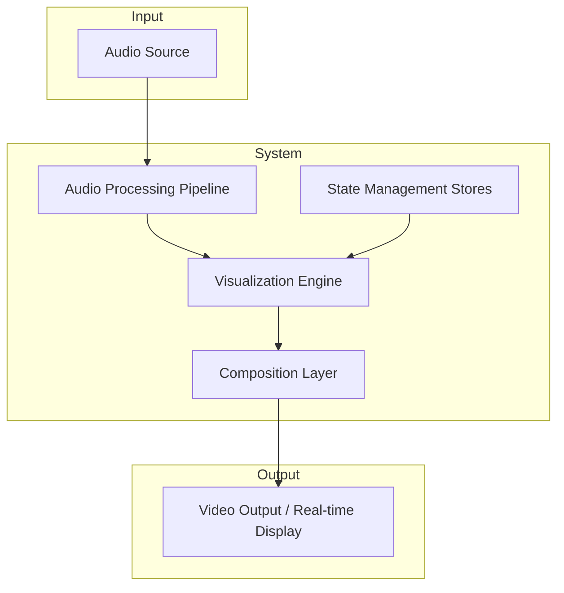
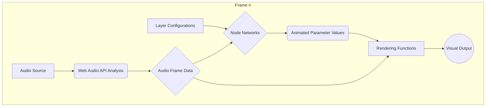
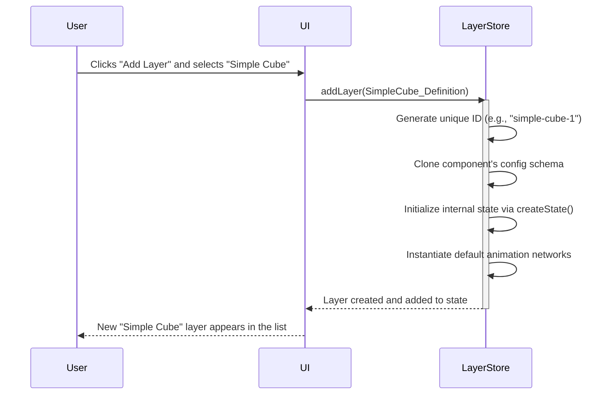
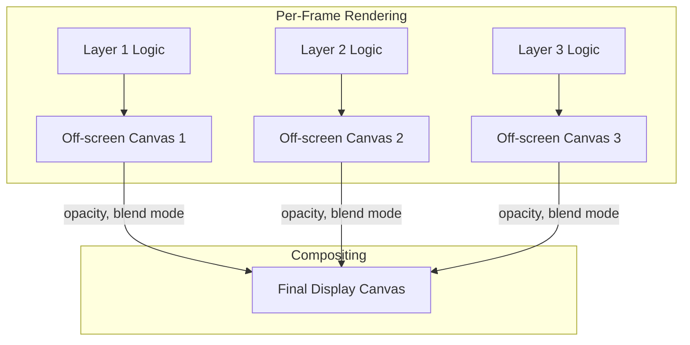
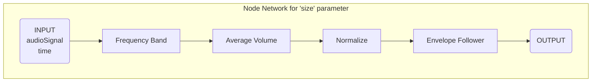
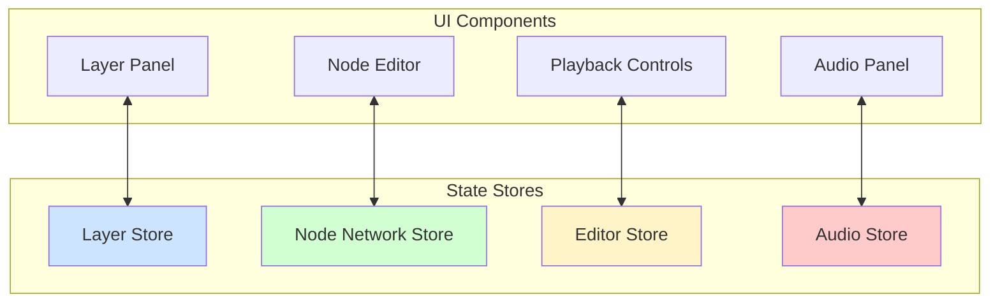

# System Architecture

The creation of compelling, custom audio-reactive visuals has traditionally been bifurcated between inflexible template-based applications and complex programming-centric creative coding frameworks. This thesis presents the architecture of the Viz Engine, a system designed to occupy the space between these two extremes. It aims to provide the flexibility of a coding framework through a highly modular, node-based visual paradigm, making dynamic visual creation accessible to a broader audience. The following conceptual model deconstructs this goal into its core architectural principles.

## A Conceptual Model of the Viz Engine

Before deconstructing the system's architecture, it is useful to establish a conceptual model. At its core, any audio visualizer can be described as a function that transforms an audio signal into a sequence of images. We can model the Viz Engine's architecture through three levels of increasing abstraction, starting from this fundamental premise.

#### Level 1: The Stateless Transducer

At the most abstract level, the system is a pure, stateless function. It takes an audio signal and a point in time as input and produces a corresponding image frame as output. The relationship is direct and repeatable: the same audio data at the same timestamp will always produce the identical image.

```mermaid
graph TD
    A[Audio Signal] --> F[Function F(Audio, Time)];
    T[Time] --> F;
    F --> I[Image Frame];
```

*Figure 1.1: A stateless model of an audio visualizer.*

#### Level 2: Introducing State

A purely stateless model is inflexible. To create a customizable and creative tool, we must introduce the concept of **state**. This state represents the user's entire project: the chosen visual elements, their configurations, and the animation logic that connects them to the audio. The function now transforms the audio signal based on this persistent user-defined state.

```mermaid
graph TD
    A[Audio Signal] --> F[Function F(Audio, Time, State)];
    T[Time] --> F;
    S[Project State] --> F;
    F --> I[Image Frame];
```

*Figure 1.2: A stateful model where user configuration modifies the output.*

#### Level 3: The System Architecture Decomposed

The third level deconstructs this abstract stateful function into its concrete architectural components. "Project State" becomes a collection of specialized **State Management** stores. The "Function" is decomposed into three primary pipelines: an **Audio Processing Pipeline** to analyze the signal, a **Visualization Engine** to interpret the state and render visuals, and a **Composition Layer** to manage timing and final output. This decomposition forms the basis of the Viz Engine's architecture.



*Figure 1.3: High-level decomposition of the Viz Engine's architecture.*

The following chapters will explore this third level in detail, examining the design and inner workings of each component.

-----

## Chapter 1: System Overview

**Chapter Goal:** To provide a high-level survey of the Viz Engine's architecture, introducing the three core pillars of its design and explaining how they synchronize to form a cohesive system for creating audio-reactive visuals.

The Viz Engine is a web-based system designed for the creation of dynamic, audio-reactive visualizations. The architecture is founded on three primary functional pillars: an audio pipeline for signal analysis, a visualization engine for rendering, and a composition layer for timing and export. These components work in concert to translate audio data into compelling visual output in real time.

[Screenshot of the main user interface of the Viz Engine]
*Figure 1.4: An overview of the Viz Engine editor interface.*

### 1.1 The Core Architectural Pillars

We designed the system around a clear separation of concerns, resulting in three distinct, cooperative subsystems.

**1. The Audio Processing Pipeline** is responsible for ingesting and analyzing audio. It leverages the Web Audio API to perform real-time frequency and time-domain analysis. Whether the source is a local file or a live audio stream, this pipeline's sole output is a consistent, frame-by-frame stream of structured audio data, ready for consumption by the visualization engine.

**2. The Visualization Engine** is the heart of the system, responsible for rendering pixels. It interprets the user's project state—a collection of visual layers—and uses the data from the audio pipeline to draw the final image. It employs a multi-canvas architecture that supports both 2D and 3D (via Three.js) rendering paths, compositing the final output from individual layer canvases.

**3. The Composition Layer**, built upon the Remotion library, serves two critical functions. Primarily, it acts as the system's "heartbeat," providing a stable, frame-accurate 60 FPS clock that dictates the update cycle for the entire application. Secondly, it provides the foundational framework for the system's video export capabilities, ensuring that what is seen in real-time can be rendered to a video file.

### 1.2 System Synchronization and Data Flow

For the system to function correctly, the audio playback, visual updates, and internal clock must remain perfectly synchronized. This is achieved by anchoring all operations to the frame-based clock provided by the Composition Layer. Every 1/60th of a second, the system performs a single, atomic update cycle.

This design results in a strictly unidirectional data flow, as illustrated below. Data originates from the audio source and the user's configuration, flows through a series of transformations, and results in a final rendered image for that frame. There are no reverse data pathways, which simplifies the system's state management and makes its behavior predictable.



*Figure 1.5: The unidirectional data flow within a single frame update.*

### 1.3 Component-Centric Rendering Paths

The Visualization Engine must be able to render both 2D and 3D graphics. Rather than a global rendering mode, this choice is made at the component level. Each visual component is a self-contained template that explicitly declares which rendering context it uses. A component designed for 2D graphics implements a `draw` function, while a 3D component implements `init3D` and `draw3D` functions.

When a user adds a component as a layer, the engine inspects its definition and provisions the appropriate rendering context—either an HTML5 Canvas 2D context or a Three.js WebGL renderer—for that layer's dedicated canvas. This allows a single composition to mix 2D and 3D layers seamlessly.

```typescript
// Example of a component definition declaring its rendering path.
const SimpleSpectrum = createComponent({
  name: 'Simple Spectrum',
  config: { /* ... parameters ... */ },
  
  // This component uses the 2D rendering path.
  draw: ({ canvasCtx, audioData, config }) => {
    // ... drawing logic using the 2D canvas context ...
  }
});

const BouncingCube = createComponent({
  name: 'Bouncing Cube',
  config: { /* ... parameters ... */ },

  // This component uses the 3D rendering path.
  init3D: ({ threeCtx }) => { /* ... one-time scene setup ... */ },
  draw3D: ({ threeCtx, config, dt }) => {
    // ... drawing logic using the Three.js context ...
  }
});
```

*Code Example 1.1: The definition for a simple 2D and 3D component.*

## Chapter 2: The Layer-Based Compositing System

**Chapter Goal:** To detail the architectural pattern that enables the creation of complex visuals from simple, reusable parts. This chapter explores the core principle of **composability** by examining the journey from a component's abstract definition to its instantiation as a concrete layer, and finally, how the engine renders and composites these layers into a final image.

The power of sophisticated graphics software, from video editors to image manipulation programs, stems from the ability to stack and blend independent visual elements. We adopted this time-tested paradigm for the Viz Engine's core architecture. A final visualization is not a monolithic entity but a **composition** of multiple layers, each contributing a distinct visual element. This approach allows users to build intricate, evolving scenes by combining and reordering simple, modular components.


*Figure 2.1: A final composition (right) is constructed from a stack of individual layers (left).*

### 2.1 The Template-Instance Pattern: From Component to Layer

To manage this system, we employ a **template-instance pattern**. A developer first defines a reusable visual blueprint, which we call a **Component**. When a user wants to add this visual to their scene, the system creates a live, configurable copy of it, which we call a **Layer**.

A Component is a self-contained package that encapsulates everything needed to bring a visual idea to life. It is defined as a plain JavaScript object using a `createComponent` factory function, which structures the definition into several key parts.

| Property          | Responsibility                                                                                             |
| ----------------- | ---------------------------------------------------------------------------------------------------------- |
| `name`            | A unique, human-readable identifier for the component.                                                     |
| `description`     | A brief explanation of the component's visual behavior.                                                    |
| `config`          | A declarative schema defining the user-configurable parameters (e.g., color, size, speed).                 |
| `defaultNetworks` | Optional pre-built animation networks for common parameters.                                               |
| `createState`     | An optional function that initializes an internal, private state for the component instance.               |
| `draw` / `draw3D` | The rendering function that draws pixels to a canvas, implementing either a 2D or 3D rendering path.         |

This clear structure provides a consistent and discoverable API for creating new visuals. A concrete example of a simple 3D component is shown below.

```typescript
const SimpleCube = createComponent({
  name: 'Simple Cube',
  description: 'A simple 3D cube that reacts to audio.',
  
  // Defines the parameters users can edit in the UI.
  config: v.config({
    color: v.color({ defaultValue: '#FF6347', label: 'Cube Color' }),
    size: v.number({ defaultValue: 2, min: 0.1, max: 10, label: 'Cube Size' })
  }),
  
  // This component will use the 3D rendering engine.
  init3D: ({ threeCtx }) => {
    // One-time setup: Create a cube mesh and add it to the scene.
    const geometry = new THREE.BoxGeometry(1, 1, 1);
    const material = new THREE.MeshStandardMaterial({ color: '#FF6347' });
    threeCtx.scene.userData.cube = new THREE.Mesh(geometry, material);
    threeCtx.scene.add(threeCtx.scene.userData.cube);
  },
  
  draw3D: ({ threeCtx, config, dt }) => {
    // Per-frame logic: Update the cube's properties based on config values.
    const cube = threeCtx.scene.userData.cube;
    if (cube) {
      cube.scale.setScalar(config.size);
      cube.material.color.set(config.color);
    }
  }
});
````

*Code Example 2.1: The definition for a basic 3D cube component.*

When a user selects a Component from the UI, a formal instantiation process begins, managed by the system's state stores. This process turns the abstract blueprint into a tangible Layer with a unique identity and a dedicated block of memory for its configuration and state.



*Figure 2.2: The sequence of events when instantiating a Component into a Layer.*

### 2.2 The Anatomy of a Layer

Once instantiated, a Layer is represented by a data structure that holds all information pertinent to its existence within the scene.

```typescript
interface LayerData {
  id: string;              // The unique identifier, e.g., "simple-cube-1".
  comp: Comp;              // A reference to its original Component definition.
  config: UnknownConfig;   // The live, editable parameter values for this instance.
  state: unknown;          // The internal, runtime-only state for its logic.
  layerSettings: {         // Compositing properties for the rendering engine.
    opacity: number;
    blendingMode: string;
    isVisible: boolean;
  };
  // ... other UI-related fields ...
}
```

It is important to distinguish between the three primary data containers on a layer:

  * **`config`**: Holds the user-facing parameters defined by the component's schema. These values are directly editable by the user through the UI and can be animated.
  * **`state`**: Holds internal data that the component's rendering logic needs to persist across frames. This is not directly editable by the user (e.g., the positions of thousands of particles in a particle system).
  * **`layerSettings`**: Contains metadata that instructs the compositing engine how to blend this layer with others.

### 2.3 The Multi-Canvas Rendering Pipeline

A key architectural decision was to **decouple the rendering of each layer**. Instead of having all layers draw onto a single, shared canvas, each layer is allocated its own independent, **off-screen canvas**. The engine iterates through the visible layers each frame, commanding each one to draw its current state onto its private canvas.

Only after all layers have completed their individual rendering operations does the final **compositing** stage occur. The engine then draws the contents of each off-screen canvas onto the main, visible canvas, from bottom to top, applying the specified `opacity` and `blendingMode` from each layer's settings at this final step.

This multi-canvas pipeline provides two significant advantages:

1.  **Isolation:** A rendering error or performance bottleneck in one layer cannot affect the others. Furthermore, a layer that has not changed visually does not need to be re-rendered, offering a path for performance optimization.
2.  **Compositing Fidelity:** Complex blend modes can be applied correctly across the entire layer's content, rather than on a per-shape basis, enabling professional-grade visual effects.

<!-- end list -->



*Figure 2.3: The multi-canvas rendering pipeline. Each layer renders independently before being composited.*

### 2.4 Layer Lifecycle and Management

The full lifecycle of a layer—from creation and duplication to reordering and eventual destruction—is managed by a dedicated state management store. When a layer is removed, the store ensures that all associated resources, including its off-screen canvas, its internal state, and any connected animation networks, are properly de-allocated to prevent memory leaks.

This structured, component-based architecture provides a robust and extensible foundation for the visualization engine. Having established how static visuals are composed, the next chapter will introduce the dynamic system that breathes life into them: the node-based animation engine.


## Chapter 3: The Node-Based Animation Engine

**Chapter Goal:** To explain the design and implementation of the system's core innovation: a visual programming environment for creating animations. This chapter details the **visual dataflow paradigm** used, the lifecycle of a node network, its computation algorithm, and the advanced features that enable sophisticated signal processing without writing code.

-----

While the layer system provides the structure for a visual scene, it is the animation engine that brings it to life. We chose to forgo a traditional timeline or keyframe-based animation model in favor of a more dynamic and expressive approach: a node-based editor. This paradigm, common in professional visual effects and game development software, allows users to construct complex behaviors by connecting simple, single-purpose processing blocks, called **nodes**, into a graph. This approach empowers users to design intricate, audio-reactive relationships in an intuitive and exploratory manner. 🎶

[Screenshot of a complex node network animating a parameter in the UI]
*Figure 3.1: A node network where audio data flows from left to right, being transformed by nodes to animate a layer's 'size' parameter.*

### 3.1 A Visual Dataflow Paradigm

Every animatable parameter in a layer—be it color, position, or a custom property—can have its own dedicated **node network**. This network is a directed acyclic graph (DAG) that computes the parameter's value for each frame. The system is best understood as a form of visual dataflow programming, where data, primarily from the audio analysis pipeline, flows through the graph and is transformed at each node.

A network is composed of three fundamental concepts:

  * **Nodes:** These are the computational units. Each node performs a specific operation, such as a mathematical calculation, a data transformation, or an audio analysis task. It receives data through its input sockets and exposes its results through its output sockets.
  * **Edges:** These are the connections that define the flow of data, linking an output socket of one node to an input socket of another.
  * **Input/Output Nodes:** Every network has special `INPUT` and `OUTPUT` nodes. The `INPUT` node serves as the gateway for global data like the audio signal and time. The `OUTPUT` node collects the final computed value and delivers it to the layer parameter being animated.

<!-- end list -->



*Figure 3.2: A conceptual diagram of a node network that animates a 'size' parameter based on the energy in a specific audio frequency band.*

### 3.2 Defining and Discovering Nodes

To ensure the system is both robust and extensible, we established a formal pattern for defining nodes. Each node is a self-contained unit created with a `createNode` factory function. This function takes a definition object that specifies the node's user-facing labels, its input and output sockets with their respective data types and default values, and most importantly, a pure `computeSignal` function that contains the node's execution logic.

```typescript
// Definition for a node that performs a mathematical operation.
const MathNode = createNode({
  label: 'Math',
  description: 'Performs a math operation on A and B.',
  
  // Defines the input sockets and their properties.
  inputs: [
    { id: 'a', label: 'A', type: 'number', defaultValue: 1 },
    { id: 'b', label: 'B', type: 'number', defaultValue: 1 },
    { id: 'operation', label: 'Operation', type: 'math-op', defaultValue: 'multiply' }
  ],
  
  // Defines the output sockets.
  outputs: [{ id: 'result', label: 'Result', type: 'number' }],
  
  // The core logic: a pure function of the inputs.
  computeSignal: ({ a, b, operation }) => {
    let result: number;
    switch (operation) {
      case 'add': result = a + b; break;
      case 'subtract': result = a - b; break;
      case 'multiply': result = a * b; break;
      case 'divide': result = b !== 0 ? a / b : 0; break;
      default: result = a;
    }
    return { result };
  }
});
```

*Code Example 3.1: A simplified definition for a versatile Math node, demonstrating the declarative API.*

This structured approach allows the system to automatically handle UI generation, type validation for connections, and serialization for every node, making it simple to extend the engine with new processing capabilities.

### 3.3 Network Evaluation and Signal Computation

At each frame, the animation engine must compute the output value for every active node network. This is handled by a **demand-driven (lazy), recursive evaluation** algorithm. When a layer requires the value of an animated parameter, the engine requests the value from that parameter's `OUTPUT` node.

The `OUTPUT` node, in turn, requests the values it needs from the nodes connected to its inputs. This process continues recursively up the graph until it reaches nodes with no connections or the global `INPUT` node.

To ensure efficiency, this process is heavily optimized with **memoization (caching)**. A per-frame cache stores the output of every node as it is computed. If the evaluation algorithm encounters a node whose value is already in the cache, it immediately returns the cached result instead of re-computing it. This has two critical benefits:

1.  **Performance:** In complex graphs where one node's output feeds into multiple downstream branches, that node's logic is only executed once per frame.
2.  **Circular Dependency Handling:** The caching mechanism inherently prevents infinite loops caused by circular dependencies. If the algorithm re-encounters a node that is already in the current evaluation stack, it can safely return its partially computed (or default) value from the cache, breaking the recursion.

### 3.4 Advanced Node Capabilities

While many nodes are simple, pure functions, the system also supports more advanced capabilities for sophisticated signal processing.

#### Stateful Nodes

Some operations, like smoothing a signal over time, require memory of past frames. We facilitate this by allowing nodes to have an internal, persistent `state` object. The `computeSignal` function for a stateful node receives this state, can use its values in its computation, and can update it for the next frame. This enables the implementation of time-based effects like envelope followers, signal integrators, and gates.

```typescript
// Snippet from an Envelope Follower node, which smooths a signal over time.
computeSignal: ({ value, attack, release }, context, node) => {
  // Retrieve persistent state for this specific node instance.
  const state = node.data.state;
  if (state.previousValue === undefined) {
    state.previousValue = 0;
  }

  // Use state from the last frame to compute the new value.
  const smoothedValue = calculateEnvelope(value, state.previousValue, attack, release, context.dt);

  // Update the state for the next frame.
  state.previousValue = smoothedValue;
  
  return { result: smoothedValue };
}
```

*Code Example 3.2: A conceptual example of a stateful node that uses data from the previous frame.*

#### Specialized Audio Nodes

The engine includes a library of specialized nodes for common audio analysis tasks. These nodes abstract away the low-level complexity of processing raw FFT data, providing user-friendly building blocks for tasks like:

  * **Frequency Band:** Isolates the energy within a specific frequency range (e.g., 40-120Hz for a kick drum).
  * **Spectral Flux:** Detects sharp changes in the audio spectrum, useful for transient detection.
  * **Envelope Follower:** Tracks the amplitude of a signal over time, with configurable attack and release.
  * **Adaptive Normalize:** Dynamically scales a signal's range based on its recent minimum and maximum values.

By providing these powerful primitives as simple nodes, the system makes advanced audio-reactive techniques accessible to non-programmers. This visual programming paradigm is the engine that drives the dynamic, responsive nature of the visualizations, transforming static layers into living, breathing elements that dance with the audio.

## Chapter 4: The Audio Processing Pipeline

**Chapter Goal:** To explain the architecture responsible for ingesting, analyzing, and distributing audio data throughout the system. This chapter details the **dual-path audio graph** that separates analysis from playback, the management of various audio sources, and the real-time analysis pipeline that feeds the animation engine. 🎤

-----

The foundation of any audio-reactive system is its ability to listen. The Viz Engine's audio pipeline is designed to be a precise and high-performance "ear," capable of handling everything from local audio files to live streams from other applications. Its primary responsibility is to capture audio and transform it into a structured, frame-synchronized stream of data that can drive the animations detailed in the previous chapter.

*Figure 4.1: The audio panel, powered by WaveSurfer.js, provides users with a visual representation of the audio and controls for playback.*

### 4.1 The Dual-Path Audio Graph

A crucial design decision was to **decouple audio analysis from audio playback**. A single audio stream passing through analysis nodes (like FFT) before reaching the speakers can sometimes introduce latency or artifacts. Furthermore, the ideal settings for analysis (e.g., zero smoothing for sharp transient detection) are often detrimental to a pleasant listening experience.

To solve this, we implemented a dual-path architecture using the Web Audio API. When an audio source is connected, its output is split. One path leads directly to the speakers for high-fidelity playback, while a parallel, independent path leads to a dedicated `AnalyserNode` for real-time data extraction.

```mermaid
graph TD
    subgraph "Web Audio API Context"
        Source[Audio Source <br> (File or Live Capture)] --> Split;
        Split --> Playback(Gain Node);
        Split --> Analysis(AnalyserNode);
        Playback --> Output((Audio Output / Speakers));
        Analysis --> Data[Frame Data Buffers];
    end
    Data --> AnimationEngine[Animation Engine];
```

*Figure 4.2: The dual-path audio graph. The audio signal is split to serve playback and analysis independently, ensuring both high-fidelity output and precise, non-destructive analysis.*

This separation is the key to achieving both clean audio output and highly responsive, accurate visualization. The `AnalyserNode` itself is not connected to the audio output, preventing any "double audio" or phasing issues.

### 4.2 Audio Source Management

The system is designed to be source-agnostic, capable of seamlessly switching between two primary types of audio input.

**File-Based Audio:** The primary mode of operation involves user-provided audio files (MP3, WAV, etc.). We use the WaveSurfer.js library to handle file loading, decoding, and the rendering of a visual waveform. This gives users a familiar interface for scrubbing through the audio timeline. Playback controls are tightly synchronized with the main composition's clock, ensuring that visual events and audio cues are perfectly aligned.

**Live Audio Capture:** For more generative or live performance scenarios, the engine can capture audio directly from other browser tabs or applications. This is achieved using the `getDisplayMedia` API. We specifically request the browser to disable its native audio processing like echo cancellation and noise suppression to ensure the analysis pipeline receives the cleanest, most unprocessed signal possible.

```typescript
// Requesting a clean audio stream for analysis.
const stream = await navigator.mediaDevices.getDisplayMedia({
  audio: {
    // These are disabled to get the rawest signal for analysis.
    echoCancellation: false,
    noiseSuppression: false,
    autoGainControl: false,
  },
  // We only need the audio, not the video.
  video: true 
});

// Create a Web Audio API source from the live stream.
const source = audioContext.createMediaStreamSource(stream);

// Connect the live source to our analysis graph.
source.connect(audioAnalyzer);
```

*Code Example 4.1: Capturing a high-quality, unprocessed audio stream from another application for live visualization.*

### 4.3 The Real-Time Analysis Pipeline

Once an audio source is connected to the `AnalyserNode`, the pipeline begins its per-frame work. The `AnalyserNode` performs a Fast Fourier Transform (FFT) on the audio signal to provide frequency-domain data, and it can also provide the raw time-domain (waveform) data.

We have configured the analyzer with specific parameters optimized for visualization:

  * **FFT Size:** An `fftSize` of **2048** provides a good balance between frequency resolution (yielding 1024 frequency bins) and temporal responsiveness.
  * **Smoothing:** The `smoothingTimeConstant` is set to **0**, which disables temporal averaging between FFT buffers. While smoothing can make a spectrum look visually pleasing, disabling it is critical for accurate, instantaneous onset detection (e.g., reacting to a single drum hit).
  * **Decibel Range:** The range is set from **-90dB to -10dB** to better capture the dynamic range of typical music, preventing quiet parts from being lost and loud parts from being overly compressed at the top of the scale.

At the beginning of each 60 FPS frame cycle, the system calls `getByteFrequencyData()` and `getByteTimeDomainData()` on the analyzer. This action populates pre-allocated `Uint8Array` buffers with the latest audio information. To optimize performance and minimize garbage collection, these buffers are created once and reused on every frame.

```typescript
// Pre-allocated buffers are held in a React ref to persist across renders.
const frequencyDataRef = useRef<Uint8Array>(new Uint8Array(analyzer.frequencyBinCount));
const timeDomainDataRef = useRef<Uint8Array>(new Uint8Array(analyzer.fftSize));

// This function is called once per frame.
const captureFrameData = () => {
  if (isPlaying) {
    // The analyzer populates the existing buffers with the latest data.
    // No new memory is allocated here.
    analyzer.getByteFrequencyData(frequencyDataRef.current);
    analyzer.getByteTimeDomainData(timeDomainDataRef.current);
  }
  return {
    frequencyData: frequencyDataRef.current,
    timeDomainData: timeDomainDataRef.current,
    // ... other metadata ...
  };
};
```

*Code Example 4.2: Efficient per-frame capture of audio data using pre-allocated and reused buffers to minimize memory pressure.*

This packet of frame-synchronized audio data is then made available to the entire system, most notably as the primary input for the node-based animation engine, closing the loop and allowing the visuals to react to the sound.

## Chapter 5: The Declarative Configuration and UI System

**Chapter Goal:** To describe the system that bridges the gap between a component's internal logic and the user's ability to control it. This chapter details our **declarative approach to configuration**, where a single, type-safe schema is used to automatically generate user interfaces, manage parameter values, and integrate with the animation engine. ⚙️

-----

A creative tool must provide its users with intuitive controls. To achieve this without coupling our visualization components to a specific UI implementation, we developed a declarative configuration system. Instead of manually building forms for each component, a developer simply defines a **configuration schema**. This schema serves as a single source of truth that the system uses to dynamically generate interactive controls, handle value persistence, and expose "hooks" for the animation engine.

### 5.1 The Schema as a Single Source of Truth

When developing a new component, the author defines its user-controllable parameters using a fluent, type-safe API. This API allows for the definition of various parameter types, such as numbers, colors, vectors, and booleans, each with its own specific constraints like minimum/maximum values and default settings.

This schema-first approach is central to the system's extensibility. The component author focuses on *what* parameters are needed, not *how* they should be rendered in the UI.

```typescript
// A configuration schema for a hypothetical "Particle Emitter" component.
const particleConfig = v.config({
  // Parameters can be organized into logical groups.
  appearance: v.group({ label: 'Appearance' }, {
    startColor: v.color({ label: 'Start Color', defaultValue: '#ff00ff' }),
    endColor: v.color({ label: 'End Color', defaultValue: '#00ffff' }),
  }),
  
  physics: v.group({ label: 'Physics' }, {
    emissionRate: v.number({ label: 'Emission Rate', defaultValue: 100, min: 0, max: 1000 }),
    particleLifetime: v.number({ label: 'Lifetime (s)', defaultValue: 2, min: 0.1, max: 10 }),
    
    // This parameter will only be visible if 'useGravity' is true.
    useGravity: v.toggle({ label: 'Use Gravity', defaultValue: true }),
    gravityStrength: v.number({
      label: 'Gravity Strength',
      defaultValue: 9.8,
      visibleIf: (allValues) => allValues.physics.useGravity === true
    })
  })
});
```

*Code Example 5.1: A declarative schema defining a component's parameters, including nested groups and conditional visibility logic.*

### 5.2 Dynamic UI Generation

The system contains a **form generator** that introspects a component's configuration schema and builds a corresponding React UI at runtime. It maps each parameter type in the schema to a specific, pre-built UI control:

  * `v.number()` maps to a slider and a precise number input.
  * `v.color()` maps to a color picker.
  * `v.toggle()` maps to a switch.
  * `v.group()` maps to a collapsible accordion section.

This automatic generation ensures a consistent user experience across all components and dramatically reduces the boilerplate code required to create new visualizations. The form handles its own state, validation, and updates, freeing the component developer to focus solely on rendering logic.

*Figure 5.1: The UI generated from the `particleConfig` schema. The "Gravity Strength" slider is only visible because "Use Gravity" is enabled.*

### 5.3 Bridging Static Values and Live Animation

A parameter's value can come from one of two sources: a **static value** set manually by the user in the form, or a **live value** computed each frame by a node network. The configuration system is responsible for managing this duality.

Each parameter control in the UI is rendered with an "animation" toggle button. When this toggle is disabled, the parameter's value is read directly from the form's state store. When a user enables the toggle, two things happen:

1.  A new node network is created and associated with this specific parameter.
2.  The UI control for the parameter becomes disabled, and in its place, a real-time display shows the live animated value being produced by the node network.

The core rendering logic of a component does not need to know where its values come from. It simply requests a parameter's value from the configuration system. Internally, the configuration system checks if animation is enabled for that parameter. If it is, it executes the corresponding node network and returns the result; otherwise, it returns the static value from the form.

```mermaid
graph TD
    subgraph Component Rendering Logic
        direction LR
        Request["Request 'size' value"]
    end

    subgraph Configuration System
        direction LR
        Check["Is 'size' animated?"];
        Request --> Check;
        Check -- No --> Static[Return Static Value <br> (e.g., 2.5)];
        Check -- Yes --> Node[Execute Node Network];
        Node --> Live[Return Live Value <br> (e.g., 1.83)];
    end
    
    Static --> Final;
    Live --> Final;

    Final[Final Value] --> Component;

    subgraph Component
        direction LR
        UseValue["Use 'size' value <br> in draw() function"]
    end
```

*Figure 5.2: The value resolution process. The configuration system acts as a gatekeeper, transparently providing either a static or a live animated value to the component.*

This architecture cleanly separates the concerns of static configuration and dynamic animation. It allows any parameter to be seamlessly transitioned between manual control and procedural, audio-reactive animation, providing a flexible and powerful workflow for the user.

## Chapter 6: The State Management Architecture

**Chapter Goal:** To detail the architecture responsible for managing the application's entire state. This chapter introduces our **multi-store approach** using the Zustand library, explains the specific responsibilities of each store, and discusses how this design optimizes performance and ensures data consistency. 💾

-----

A real-time graphics application is fundamentally a state machine. Every user interaction—adding a layer, tweaking a slider, connecting a node—mutates this state, which in turn dictates the visual output on the next frame. Managing this complexity is a critical architectural challenge. We chose the Zustand library for its minimalism and performance, building our architecture around a **multi-store pattern**, where the application state is partitioned into several independent, domain-specific stores.

This approach contrasts with a single, monolithic state tree. By splitting the state, we achieve a clear separation of concerns and a significant performance benefit: a React component can subscribe to updates from only the specific store it needs. A UI component that adjusts layer opacity, for instance, will not re-render when the audio source changes, as those pieces of state live in different stores.

### 6.1 A Tour of the State Stores

The system's state is distributed across a handful of core stores, each with a precisely defined responsibility.

| Store                 | Domain                  | Core Responsibilities                                                                                             |
| --------------------- | ----------------------- | ----------------------------------------------------------------------------------------------------------------- |
| **Layer Store** | Visualization           | Manages the array of `LayerData` objects; handles the creation, deletion, duplication, and reordering of layers.      |
| **Node Network Store**| Animation               | Holds the graph structure (nodes and edges) for every animated parameter; triggers network evaluation.             |
| **Audio Store** | Audio I/O               | Manages the Web Audio API context, the current audio source (file or live), and the `AnalyserNode`.                 |
| **Editor Store** | Application & UI        | Contains global UI state, such as playback status (play/pause), quality settings, and references to the player.     |
| **Value Stores** | Parameter Data          | A collection of smaller stores that hold the static values for layer configurations and node inputs.               |

This distributed architecture can be visualized as a set of cooperating services.



*Figure 6.1: High-level view of UI components subscribing to their relevant state stores.*

### 6.2 Cross-Store Communication and Data Flow

While the stores are independent, they must communicate to execute complex operations. This is achieved not through a central dispatcher, but through direct, imperative calls between stores. This approach is simple and effective for a system with well-defined data flows.

A prime example is the creation of a new layer. This action originates in the `Layer Store`, but it has cascading effects that touch other parts of the system.

1.  The `Layer Store`'s `addLayer` function is called.
2.  It creates the new `LayerData` object and adds it to its internal list.
3.  It then calls a function in the **Value Store** to initialize the new layer's static parameter values based on the component's defaults.
4.  Finally, it inspects the component for any `defaultNetworks` and, if present, calls the **Node Network Store**'s `setNetwork` function to instantiate those animation networks.

This chain of responsibility ensures that when a layer is created, it is fully initialized across all relevant state domains. A similar cleanup process occurs upon layer deletion.

### 6.3 Performance and Subscription Optimization

The primary performance benefit of the multi-store architecture lies in **selective subscriptions**. A component that only needs to know if the audio is playing can subscribe to just that single boolean value from the `Editor Store`, ignoring all other state changes in the application.

```typescript
// A React component subscribing to a single, specific piece of state.
// This component will only re-render when the `isPlaying` boolean changes.
const PlayPauseButton = () => {
  const isPlaying = useEditorStore((state) => state.isPlaying);
  const setIsPlaying = useEditorStore((state) => state.setIsPlaying);

  return <Button onClick={() => setIsPlaying(!isPlaying)}>{isPlaying ? 'Pause' : 'Play'}</Button>;
};

// An anti-pattern: subscribing to the entire store object.
// This would cause the component to re-render on ANY change in the editor store.
const InefficientButton = () => {
  const editorStore = useEditorStore(); // Avoid this!
  // ...
};
```

*Code Example 6.1: Demonstrating efficient, selective subscription with Zustand selectors to minimize re-renders.*

We enforce this pattern throughout the application. Components are designed to be "state-aware" in the most minimal way possible, subscribing only to the precise slices of data required for their rendering logic. This fine-grained dependency tracking is crucial for maintaining a responsive user interface, especially while the visualization is rendering at 60 FPS in the background.

### 6.4 State Persistence and Hydration

To provide a seamless user experience, the entire state of a project is automatically saved to the browser's **IndexedDB** storage. We use Zustand's `persist` middleware to handle this. This middleware intercepts state changes and writes them to the database.

However, not all state is serializable or desirable to persist. For instance, live references to `<canvas>` elements or the `AudioContext` cannot be stored. We implement custom **partialization** and **merge** functions for our stores to manage this.

  * **Partialization:** Before writing to the database, a `partialize` function is run on the state. It strips out non-serializable data and transforms complex objects into a storable format (e.g., storing a component reference by its unique name string).
  * **Merging:** When the application loads, the persisted state is read from IndexedDB. A `merge` function then intelligently combines this persisted data with the initial, default state of the application, re-establishing references and reconstructing the full application state.

This robust persistence layer ensures that a user can close their browser and return to their work exactly where they left off, creating a more professional and reliable user workflow.

## Chapter 7: Performance and Optimization

**Chapter Goal:** To concisely outline the key architectural decisions and specific techniques employed to ensure the application remains responsive and interactive. This chapter focuses on pragmatic optimizations across rendering, computation, and memory management, while also identifying significant avenues for future performance enhancements. 🚀

---

Maintaining high performance is not a single feature but a core architectural tenet of any real-time graphics system. The primary goal for the Viz Engine is to sustain a consistent 60 frames per second (FPS) during playback, ensuring smooth animation and a responsive user interface. Our optimization strategy is multi-faceted, addressing potential bottlenecks across the entire application stack.

### 7.1 Key Optimization Strategies

We focused on three critical areas of optimization that provide the most significant performance impact.

**1. Rendering: The Multi-Canvas Pipeline**
As detailed in Chapter 2, each layer renders to its own dedicated **off-screen canvas**. This isolates rendering operations, preventing a complex or slow-to-render layer from forcing all other layers to be redrawn. The final scene is then composited efficiently, often leveraging GPU hardware acceleration for blending operations. This is the single most important rendering optimization in the system.

**2. Computation: Memoized, On-Demand Evaluation**
The node-based animation system is computationally intensive. To manage this, we use a **lazy evaluation** model combined with **memoization**. A node's `computeSignal` function is only executed if its value is demanded by a downstream node, and its result is then cached for the remainder of that frame. This ensures that each node is computed at most once per frame, drastically reducing redundant calculations in complex graphs.

**3. Memory Management: Buffer and Object Reuse**
To minimize the impact of JavaScript's garbage collector—a common source of stuttering in real-time applications—we aggressively reuse memory wherever possible.
* **Audio Buffers:** The `Uint8Array` buffers used for audio analysis are allocated once and are repopulated with new data each frame, avoiding constant memory allocation and deallocation.
* **Object Pooling (in select components):** For components that generate a large number of short-lived objects per frame (e.g., particle systems), we employ object pooling patterns to recycle objects instead of creating new ones.


*Figure 7.1: A snapshot of the application's built-in performance monitor, showing a stable frame rate under a moderately complex load.*

### 7.2 The Quality-Performance Trade-off

Users are given direct control over the balance between rendering quality and performance via a **resolution multiplier**. This setting allows the internal rendering canvases to be created at a fraction (e.g., 0.5x for performance) or a multiple (e.g., 2x for high-quality video exports) of the display resolution. This simple but effective control allows the user to adapt the engine's resource consumption to their specific hardware and use case.

### 7.3 Future Optimization Pathways

While the current implementation performs well for many use cases, several powerful optimization techniques have been identified for future work to handle scenes of much greater complexity.

* **Offloading to Web Workers:** The most significant planned enhancement is to move the entire node network computation and, potentially, individual layer rendering logic off the main browser thread and into **Web Workers**. This would prevent complex animations from blocking UI updates, leading to a consistently responsive interface even under heavy computational load.

* **WebAssembly (Wasm) for Critical Nodes:** For computationally expensive nodes, such as those performing complex mathematical or physics simulations, the core logic could be rewritten in a language like Rust or C++ and compiled to **WebAssembly**. This would provide near-native performance for the most critical parts of the signal processing pipeline.

* **GPU Computation (GPGPU):** For massively parallel tasks, such as updating the state of millions of particles or performing complex image processing, we plan to leverage **WebGL compute shaders**. This would move these workloads from the CPU directly onto the GPU, unlocking a dramatic increase in processing power for suitable component types.

## Chapter 8: Project Persistence and Data Management

**Chapter Goal:** To outline the strategies for saving and loading user projects. This chapter describes our **two-tier persistence architecture**, which combines seamless, automatic session saving with explicit, file-based project management, and discusses the potential for future cloud-based collaboration. 🗂️

-----

A creative tool is only as good as its ability to reliably save a user's work. For the Viz Engine, we designed a two-tiered persistence strategy to cater to two distinct user needs: the need for work to be saved automatically during a session, and the need to export and share a project as a self-contained file.

### 8.1 Two-Tier Persistence Strategy

**Tier 1: Automatic Session Persistence (IndexedDB)**
To prevent data loss and provide a fluid user experience, the application's state is automatically and continuously saved to the browser's **IndexedDB**. This acts as a robust "autosave" feature. We use a **throttled writer** that batches state changes and commits them to the database every 100ms. This prevents excessive disk I/O during rapid interactions (like scrubbing a slider) while ensuring that recent changes are always saved. This local, browser-based storage is the foundation of our session management.

**Tier 2: Manual Project Portability (File Export/Import)**
For sharing, versioning, and backup, users can manually export their entire project to a single `.json` file. This process gathers the serializable state from all relevant stores, packages it with a version number, and bundles it for download. A user can then import this file into any other instance of the Viz Engine to perfectly replicate the saved project state. This ensures that projects are portable and not locked to a single browser or machine.

```mermaid
graph TD
    A[User Actions <br> (e.g., moves a slider)] --> S[State Stores];
    S --"throttled updates (every 100ms)"--> DB[(IndexedDB <br> Automatic Persistence)];

    subgraph "Manual Operations"
        direction LR
        E[Export Button] --> S;
        S --> F[project.json <br> Portable File];
        F --> I[Import Button];
        I --> S;
    end
```

*Figure 8.1: The two-tier persistence model, showing both automatic background saving and manual file operations.*

### 8.2 The Serialization Challenge: What to Save

A significant challenge in persisting a complex application is that not all state can be directly converted to JSON. Live objects like the `AudioContext`, WebGL renderers, or references to HTML elements are non-serializable and must be reconstructed when a project is loaded.

Our solution is to implement custom **serialization (`partialize`)** and **deserialization (`merge`)** logic for our state stores.

  * When saving, the `partialize` function creates a "dehydrated" version of the state. It strips out live references and converts complex objects into a serializable format. For example, a reference to a full Component object is replaced with a simple string containing the component's unique name.
  * When loading, the `merge` function "rehydrates" this data. It reads the dehydrated state and, using the component name string, looks up the full Component definition from the live component registry to restore the original reference. This ensures the loaded project is linked to the current, running version of the code.

<!-- end list -->

```typescript
// A simplified example of the partialization process for a layer.
const layerToSave = {
  id: 'cube-1',
  // The full component object, including functions.
  comp: SimpleCubeComponent, 
  // Live reference to a canvas element.
  mirrorCanvases: [HTMLCanvasElement], 
  // ... other data
};

// The partialize function transforms it for serialization.
const serializedLayer = {
  id: 'cube-1',
  // The component is now referenced only by its unique name.
  comp: { name: 'Simple Cube' }, 
  // The non-serializable canvas reference is stripped out.
  // ... other data
};
```

*Code Example 8.1: Transforming a live `Layer` object into a serializable format for persistence.*

### 8.3 Future Work: Cloud Persistence and Collaboration

The current architecture, with its well-defined state stores and serialization logic, provides a strong foundation for moving beyond local persistence to a fully online, collaborative platform. The serialized JSON project file serves as a perfect Data Transfer Object (DTO) for a backend API.

A future version of the engine could integrate with a real-time database provider (such as Supabase, Firebase, or Convex). This would enable several powerful features:

  * **Cloud Storage:** Users could save their projects to an account and access them from any device.
  * **Real-time Collaboration:** Multiple users could work on the same project simultaneously, with state changes from one user being broadcast to all other collaborators in real time.
  * **Project Sharing:** Users could share a simple URL that links directly to a specific version of a project, enabling a public gallery or community showcase.

This evolution would transform the Viz Engine from a standalone, client-side tool into a collaborative, web-native creative suite.

## Chapter 9: The Editor UI and User Experience

**Chapter Goal:** To detail the design of the user interface and the key interaction patterns that facilitate a creative workflow. This chapter breaks down the editor's layout, panel by panel, to illustrate how users interact with the core systems of the Viz Engine. 🎨

---

A powerful engine requires an intuitive and efficient control surface. The Viz Engine's user interface is designed to support a fluid, exploratory workflow, enabling users to move seamlessly between composing scenes, configuring layers, and designing complex animations. The entire editor is built as a single-page application with a flexible, multi-panel layout.

[Screenshot of the full Viz Engine editor interface in action]
*Figure 9.1: The main editor layout, divided into a layer management panel on the left and a primary workspace with the canvas, animation editor, and audio controls on the right.*

### 9.1 A Multi-Panel Workspace

The editor's foundation is a **resizable panel system** that allows users to customize their workspace. By default, the layout is organized into three primary zones, designed to keep the most relevant information visible and accessible.
* **The Left Panel** is dedicated to scene composition and layer management.
* **The Top-Right Panel** contains the main visual output canvas.
* **The Bottom-Right Panel** houses contextual tools, primarily the audio timeline and the node-based animation editor.

This division allows a user to, for example, see their list of layers, view the final render, and edit an animation network simultaneously, minimizing the need for context switching.

### 9.2 The Layer Management Panel

All scene composition begins in the left panel. This is where users discover visual components and manage the layers in their project.

At the top of the panel is a search and discovery interface that allows users to find and add new components to their scene. Below this, the main area is occupied by the **layer stack**. This is a vertical, sortable list of all layers in the current project, displayed from top to bottom, which corresponds to the rendering order (topmost layer in the UI is rendered in front).

[Screenshot of the left panel showing the layer stack]
*Figure 9.2: The layer management panel, showing the "Add New Layer" button and a stack of configurable layer cards.*

Each layer is represented by a **collapsible card**. In its collapsed state, the card provides essential controls: a drag handle for reordering, visibility toggles, and a live thumbnail preview of the layer's content.

[Screenshot of a single, expanded layer card]
*Figure 9.3: An expanded layer card, revealing the dynamically generated form with sliders and color pickers for the component's parameters.*

Expanding the card reveals the full set of controls for that layer. This includes general settings like **opacity** and **blend mode**, as well as the dynamically generated form for the component's specific parameters, as detailed in Chapter 5. It is here that the user can manually adjust values or enable animation for any parameter.

### 9.3 The Primary Workspace

The right side of the editor contains the main canvas and the animation tools. The largest panel is the **Remotion Player**, which displays the final, composited visual output. It includes a standard set of professional playback controls for play, pause, seeking, and fullscreen mode.

[Screenshot of the Animation Builder overlaying the main canvas]
*Figure 9.4: The Animation Builder interface, a semi-transparent overlay where users can create and edit node networks.*

When a user chooses to animate a parameter, the **Animation Builder** appears as an overlay on top of the main canvas. This design choice is deliberate: it allows the user to see the effect of their animation network on the main visuals in real-time, directly in the background. The node editor includes a dedicated toolbar for managing presets, undo/redo history, and provides a button to minimize the interface, returning focus to the main visual output.

The panel at the bottom of the workspace contains the **Audio Panel**, which displays the audio waveform and provides controls for loading audio files or initiating live capture. This panel is also synchronized with the main player, ensuring the playback head on the timeline always matches the currently rendered visual frame.

By integrating these distinct but related tools—layer management, a live preview, and animation editing—into a cohesive, interactive workspace, the UI aims to create a "flow state" for the user, where the technical details fade into the background, allowing for a more direct and intuitive creative process.

## Chapter 10: Extensibility and Developer Experience

**Chapter Goal:** To detail the patterns and APIs that allow developers to extend the Viz Engine's capabilities. This chapter examines the process of creating new visual **Components** and custom processing **Nodes**, and discusses how the system's structured design is particularly well-suited for AI-assisted code generation. 🧑‍💻

-----

A creative tool thrives on its ability to grow. We designed the Viz Engine's architecture to be highly extensible, allowing developers to easily contribute new visual elements and data processing capabilities. This is achieved through a consistent, type-safe, and declarative API for both visual components and animation nodes. This focus on developer experience (DX) not only simplifies manual coding but also creates a predictable structure that is ideal for automation and AI-powered code generation.

### 10.1 Creating a New Visual Component

A **Component** is the fundamental building block of any visual scene. To simplify their creation, we developed a `createComponent` factory function that takes a single definition object. This pattern provides a clear and structured way to package a component's configuration, logic, and metadata.

A component author only needs to focus on three key areas:

1.  **Configuration Schema:** Defining the public parameters using the `v.config()` API, as detailed in Chapter 5. This schema automatically generates the component's UI.
2.  **Rendering Logic:** Implementing either a `draw` function for 2D visuals or `init3D`/`draw3D` functions for 3D visuals.
3.  **State Management (Optional):** Providing a `createState` function if the component needs to maintain an internal state across frames.

The rendering functions receive a single, well-typed context object containing everything they need to operate, such as the layer's current `config` values, the `audioData` for the frame, and the relevant rendering context (`canvasCtx` or `threeCtx`).

```typescript
import { createComponent, v } from 'viz-engine';
import * as THREE from 'three';

// A complete, functional component definition.
export const RotatingCube = createComponent({
  name: 'Rotating Cube',
  config: v.config({
    color: v.color({ defaultValue: '#FF6347' }),
    rotationSpeed: v.number({ defaultValue: 1, min: -5, max: 5 }),
  }),

  // Setup runs once when the layer is created.
  init3D: ({ threeCtx }) => {
    const geometry = new THREE.BoxGeometry(1, 1, 1);
    const material = new THREE.MeshStandardMaterial();
    const cube = new THREE.Mesh(geometry, material);
    
    // Store the cube in the scene's userData for access in draw3D.
    threeCtx.scene.userData.cube = cube;
    threeCtx.scene.add(cube);
  },

  // draw3D runs every frame.
  draw3D: ({ threeCtx, config, dt }) => {
    const { cube } = threeCtx.scene.userData;
    if (cube) {
      cube.material.color.set(config.color);
      cube.rotation.y += config.rotationSpeed * dt;
    }
  },
});
```

*Code Example 10.1: A complete and minimal definition for a new 3D component.*

Once defined, the component file is added to a central index. The application automatically discovers it, registers it, and makes it available in the "Add New Layer" search menu, with full support for hot-reloading during development.

### 10.2 Creating a New Animation Node

The same principle of a declarative, structured API applies to creating new **Nodes** for the animation engine. This allows developers to easily add custom data processing and audio analysis capabilities to the visual programming environment.

The `createNode` factory function requires a definition of the node's `inputs` and `outputs` (including their data types and default values) and a `computeSignal` function that contains the node's core logic.

```typescript
import { createNode } from 'viz-engine';

// A node that computes the Root Mean Square (RMS) of an audio signal.
export const RmsNode = createNode({
  label: 'RMS',
  description: 'Calculates the Root Mean Square (average power) of a data array.',
  
  // This node expects an array of numbers (like audio data).
  inputs: [{ id: 'data', type: 'data-array' }],
  
  // It outputs a single number.
  outputs: [{ id: 'rms', type: 'number' }],

  computeSignal: ({ data }) => {
    if (!data || data.length === 0) {
      return { rms: 0 };
    }

    // Standard RMS calculation.
    const sumOfSquares = data.reduce((sum, value) => sum + value * value, 0);
    const meanSquare = sumOfSquares / data.length;
    const rms = Math.sqrt(meanSquare);

    return { rms };
  },
});
```

*Code Example 10.2: A complete definition for a custom audio analysis node.*

This functional and type-safe approach makes it straightforward to extend the animation system's vocabulary, enabling both developers and users to build increasingly sophisticated signal processing graphs.

### 10.3 Architecture for AI-Assisted Development

The highly structured and declarative nature of both the `createComponent` and `createNode` APIs is not just beneficial for human developers; it makes the codebase exceptionally well-suited for **Large Language Model (LLM) assisted code generation**.

Because the API provides a clear, constrained, and type-safe "template," an LLM can be prompted to generate new components with a high degree of success. The model can focus on the creative logic within the rendering functions, while the surrounding boilerplate (configuration, state management, registration) is handled by the consistent API structure. This opens up the possibility for a workflow where a developer can describe a visual idea in natural language and have an AI generate a functional, ready-to-use component file, drastically accelerating the prototyping and development process.

## Chapter 11: Testing and Quality Assurance

**Chapter Goal:** To outline a pragmatic testing strategy suited for the Viz Engine. This chapter describes how the system's modular architecture facilitates unit and integration testing and proposes a plan for future automated testing, including visual regression tests. ✅

-----

While the current implementation of the Viz Engine is a prototype without a comprehensive test suite, the system was designed from the ground up with **testability** in mind. The strong separation of concerns, the use of pure functions for computation, and the declarative nature of components create an architecture that is well-prepared for robust automated testing.

### 11.1 A Strategy for Testing a Visual System

Testing a highly visual and interactive application requires a multi-layered approach. We can break this down into three primary categories of tests.

| Test Category           | Scope                                       | Purpose                                                                                    |
| ----------------------- | ------------------------------------------- | ------------------------------------------------------------------------------------------ |
| **Unit Tests** | Individual functions, nodes, components     | Verify that the smallest pieces of logic behave correctly in isolation.                    |
| **Integration Tests** | Interactions between modules                | Ensure that different parts of the system (e.g., audio and animation) work together as expected. |
| **Visual Regression Tests** | Pixel-level output                        | Automatically detect unintended visual changes by comparing screenshots against a baseline. |

### 11.2 Unit Testing the Core Logic

The most straightforward tests to implement are unit tests for our computational units: the animation nodes. Because the `computeSignal` function of most nodes is a pure function—its output depends only on its inputs—we can test it without any complex setup. We provide it with a set of known inputs and assert that it produces the expected output.

```typescript
import { MathNode } from './nodes/MathNode';

// A unit test for the MathNode's computation logic.
describe('MathNode', () => {
  it('should correctly perform the "add" operation', () => {
    // Arrange: Define the inputs for the node.
    const inputs = { a: 5, b: 10, operation: 'add' };

    // Act: Execute the node's core logic.
    const result = MathNode.computeSignal(inputs);

    // Assert: Check if the output is as expected.
    expect(result.result).toBe(15);
  });

  it('should handle division by zero gracefully', () => {
    const inputs = { a: 5, b: 0, operation: 'divide' };
    const result = MathNode.computeSignal(inputs);
    expect(result.result).toBe(0);
  });
});
```

*Code Example 11.1: A unit test for an animation node, verifying its functional correctness.*

Similarly, the non-visual aspects of a visualization component, such as its configuration schema or internal state logic, can be effectively unit tested.

### 11.3 Future Work: Visual Regression Testing

The most significant challenge in testing a visual application is verifying the visual output itself. Manually checking the rendering after every code change is impractical and error-prone. The planned solution for this is **visual regression testing**.

The proposed workflow is as follows:

1.  **Create Test Cases:** We will create a suite of test projects, each designed to render a specific component or feature in a deterministic way (e.g., using a pre-recorded audio snippet).
2.  **Generate Baseline Images:** We will run a testing script that loads each test project, renders a specific frame, and saves a screenshot of the output canvas. These initial screenshots are manually approved and stored as the "baseline" or "golden" images.
3.  **Automated Comparison:** After any future code changes, the testing script is run again. It generates new screenshots and compares them, pixel by pixel, against the baseline images.
4.  **Detect Regressions:** If any pixel differences are detected above a certain threshold, the test fails. This immediately alerts the developer that their change had an unintended visual consequence. A human can then review the difference and either approve the new image as the baseline or fix the bug.

*Figure 11.1: An example of a visual diff, highlighting the pixels that have changed between a baseline image and a new rendering, allowing for rapid detection of visual bugs.*

By automating the process of "looking at the pixels," visual regression testing would provide a powerful safety net, allowing us to extend and refactor the rendering engine with a high degree of confidence that we are not introducing visual defects. This, combined with unit tests for the core logic, forms a comprehensive and practical quality assurance strategy for the Viz Engine.

## Chapter 12: Deployment and Future Work

**Chapter Goal:** To discuss the practical considerations of deploying the Viz Engine as a web application, outline the current deployment strategy, and present a roadmap for future development, including server-side video rendering and a concluding summary of the project's contributions. 🌐

***

The final stage of a software project is its deployment. The Viz Engine is built using Next.js, a choice that provides both a powerful local development environment and a flexible path to production. The architecture is primarily **client-side**, meaning the core visualization and audio processing happens in the user's browser. This has significant implications for scalability and performance.

### 12.1 Client-Side Architecture: Benefits and Trade-offs

By executing all real-time logic on the client, we leverage the user's own hardware (CPU and GPU). This is a highly scalable model: the cost and computational load do not increase for the server as more users access the application. It also allows for direct hardware access, which is critical for low-latency audio analysis and high-framerate WebGL rendering.

The primary trade-off is a dependency on modern browser technology. The user must have a browser that supports the Web Audio API and WebGL. While support for these technologies is widespread, this architectural choice precludes the application from running on very old or resource-constrained devices.


*Figure 12.1: The Viz Engine is currently deployed on Vercel, which provides a seamless, Git-based workflow for continuous integration and deployment.*

The application is deployed as a static site on **Vercel**. This provides a global Content Delivery Network (CDN), ensuring fast load times for users anywhere in the world, with minimal configuration.

### 12.2 Future Work: Server-Side Video Export

The most significant planned feature is the implementation of **server-side video exporting**. While the real-time engine runs on the client, rendering a high-resolution, multi-minute video is a computationally intensive task that is not well-suited for a browser environment.

Our proposed solution leverages the **Remotion** library's server-side rendering capabilities, deployed as a serverless function on a cloud platform like AWS Lambda.

The export workflow would be:
1.  The user finalizes their project in the client-side editor and clicks "Export Video."
2.  The client serializes the entire project state into a JSON object and sends it to a dedicated API endpoint.
3.  This endpoint triggers a serverless function, which programmatically launches a headless browser.
4.  The server-side function "plays" through the composition frame by frame, saving each rendered frame.
5.  These frames are then encoded into a final video file (e.g., an MP4) using FFmpeg.
6.  Upon completion, a link to the finished video is provided to the user.

This hybrid architecture combines the best of both worlds: a responsive, scalable client-side application for real-time creation, and a powerful, on-demand server-side pipeline for heavy-duty batch processing tasks like video rendering.

### 12.3 Chapter Summary

This chapter has provided a comprehensive overview of the Viz Engine's system architecture, from high-level deployment strategies to the specific design patterns that ensure its performance and extensibility. We have examined the benefits of a **client-side-first approach**, which leverages user hardware for scalable, real-time rendering, while also outlining a clear path toward **server-side video exporting** for heavy-duty processing tasks.

Throughout the preceding chapters, we have deconstructed the engine into its core systems:
* A **layer-based compositing system** for building complex scenes from simple parts.
* A **declarative UI and configuration system** that decouples component logic from its presentation.
* A powerful **node-based animation engine** that enables dynamic, audio-reactive behavior through a visual dataflow paradigm.
* Robust **state management and persistence** architectures that ensure a reliable and fluid user workflow.

Together, these systems form a cohesive and powerful foundation for creative expression. The resulting architecture serves as a robust proof-of-concept, demonstrating that modern web technologies can be used to build high-performance, professional-grade creative tools.